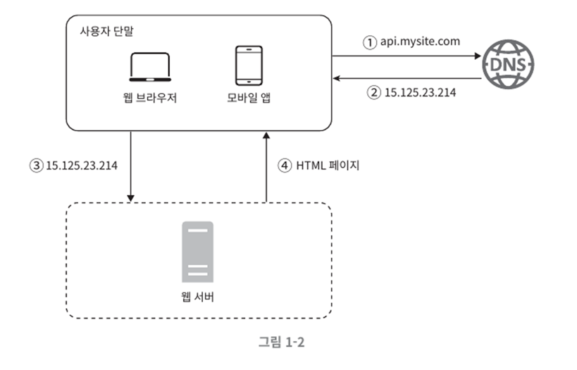

# 001. Scale From Zero To Millions Of Users

## Single server

Run web application, database, cache, etc. all on one server

## Separate database server

As the number of users increases, separate the web server and database server.

## Which database?

### RDBMS

- Express data as tables, rows, and columns
- Join data from multiple tables based on relationships

### NoSQL

- Very low response delay time required
- Not relational data (unstructured data)
- Need to store a very large amount of data

## Vertical scaling vs Horizontal scaling

### Vertical scale up (slace up)

- Add high-end resources to server (better CPU, more RAM, etc.)
- Can be a good choice when the amount of traffic flowing into the server is small.
- There are limits to vertical scale expansion. CPU and memory cannot be expanded infinitely on one server.
- It does not suggest automatic recovery (failover) plans or multiplexing plans for failures.
- If a server failure occurs, the service is completely stopped.

### Horizontal scaling (slace out)

- Add more servers
- Suitable for large-scale applications
- A load balancer is needed to evenly distribute user traffic across servers.

## Load balancer

It serves to evenly distribute the traffic load to web servers belonging to the load balancing set.

- Clients do not access the server directly but access the load balancer.
- The load balancer distributes traffic and deliver requests to servers.
- The load balancer solves the no failover problem and improves the availability of the web layer.

(If server 1 goes down, all traffic is sent to server 2)

## Database multiplexing

- Database server multiplexing
- Better performance: All data change operations are distributed only to the Master Database server, and read operations are distributed only to the Slave Database server.
- Stability: Data is preserved even if part of the database server is destroyed by a natural disaster.
- Availability: Even if one database server fails, service can continue with data on other servers.

### Master Database

- Save original data
- Supports write operation

### Slave Database

- Save a copy of data
- Only read operation is supported
- Most applications have far more read operations.
- Therefore, the number of Slave Databases is greater

## Load balancer and database multiplexing

## Cache

- Improved response time
- A cache is a storage that stores expensive calculation results and frequently referenced data in memory and allows requests to be processed more quickly.
- A cache server is a place where data is temporarily stored. Much faster than database

## Things to note when using cache

- Use a cache when data updates do not occur frequently and references occur frequently.
- The cache places data in volatile memory, so data to be stored permanently should not be placed in the cache.
- Establish cache data expiration policy by setting appropriate expiration date
- Maintain consistency of the original in the data store and the copy in the cache
- Distribute cache servers to avoid single point of failure (SPOF)

## CDN(Content Delivery Network)

- Response time can be improved by moving static content to CDN (Content Delivery Network)
- Retrieve and deliver static content from a CDN server close to the user

## Stateless web layer

Remove state information (such as user session data) from the web tier to scale the web tier horizontally.

## State information-dependent architecture

- Requests from the same client must always be sent to the same server.
- The load balancer provides sticky session functionality, but it places a burden on the load balancer.

## Stateless architecture

- When the web server needs status information, it retrieves data from the shared store.
- HTTP requests from users can be forwarded to any web server.
- Simple, stable, easy to scale

## Multiple data center architecture

- geoDNS-routing: Connecting users to the geographically closest data center
- geoDNS: Determines which IP address to translate the domain to based on the user’s location.

### Things to be solved

- Traffic bypass: An effective way to send traffic to the correct data center (solved with GeoDNS)
- Data synchronization

## Message queue

- Components that support message durability and asynchronous communication
- Producer creates a message and publishes it to the message queue → A consumer server is connected to the queue → Receives the message and performs appropriate actions.
- Producers can issue messages even if the consumer process is down.
- Consumers can receive messages even if the producer server is not available.

## Log, metric, automation

- Log: Makes it easy to find system errors and problems
- Metrics: Useful information about business status, easily identify current system status
- Automation: Utilize automation tools to increase productivity. Continuous integration, build/test/deployment automation

## Scaling up the database

1) Vertical expansion (scale up)

- Add more or high-performance resources to existing servers
- However, CPU and RAM cannot be expanded indefinitely.

2) Horizontal expansion (sharding)

- Improve performance by adding more servers

## Things to be solved when introducing sharding

- Resharding: When there is too much data to handle with one shard.
- Hotsopt key: Problem with server overload due to queries being concentrated on a specific shard
- Joins and denormalization: Joining data across multiple shards becomes difficult

## Summary of techniques for expanding system scale

- The web layer is a stateless layer.
- Introducing multiplexing in all layers
- Cache as much data as possible
- Support multiple data centers
- Static content will be served through CDN
- The data layer will expand its scale through sharding.
- Each layer should be divided into independent services
- Continuously monitor the system and utilize automation tools