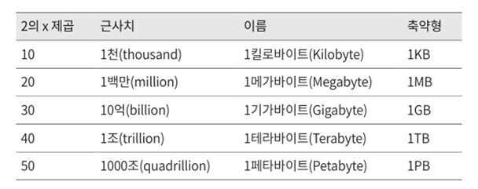

# 002.Back-of-the-envelope Estimation

- Calculate estimates based on commonly accepted performance figures
- To see which design meets the requirements
- Numbers related to power of 2, response delay, and availability

## square number of 2

- The unit of data volume is expressed as a power of 2.
- The minimum unit is 1 byte and consists of 8 bits.
- The memory size occupied by one ASCII character is 1 byte.

## Response delay value

- Response delay values of operations implemented on a typical computer
- Can measure the processing speed of computer operations

- Memory is fast, but disk is still slow (avoid disk seeks as much as possible)
- Compress data before sending it over the Internet.
- Data centers are distributed across multiple regions, and it takes time to send and receive data between centers.

## Numbers related to availability

- High availability is a term that refers to the ability of a system to operate continuously and without interruption for long periods of time.
- 100% if the system has never stopped
- Operators such as Amazon, Google, and Microsoft provide SLAs of over 99% (SLA: Service Level Agreement)

### Twitter QPS and storage requirements estimation

1. QPS (Query Per Second) estimate
- Daily active users = 300 million * 50% = 150 million
- QPS = 150 million * 2 tweets / 24 hours / 3600 seconds = approximately 3500
- Maximum QPS (Peek QPS) = 2 * QPS = approximately 7000

2. Storage requirements for media storage
- Average tweet size
64 bytes in tweei_id
140 bytes for text
Media 1MB
- Media storage requirement = 150 million * 2 * 10% * 1MB = 30TB/day
- Storage requirement to store media for 5 years = 30TB * 365 * 5 = approximately 55PB

### Key words about back-of-the-envelope estimation

QPS, Max QPS, Storage Requirement, Cache Requirement, Number of Servers