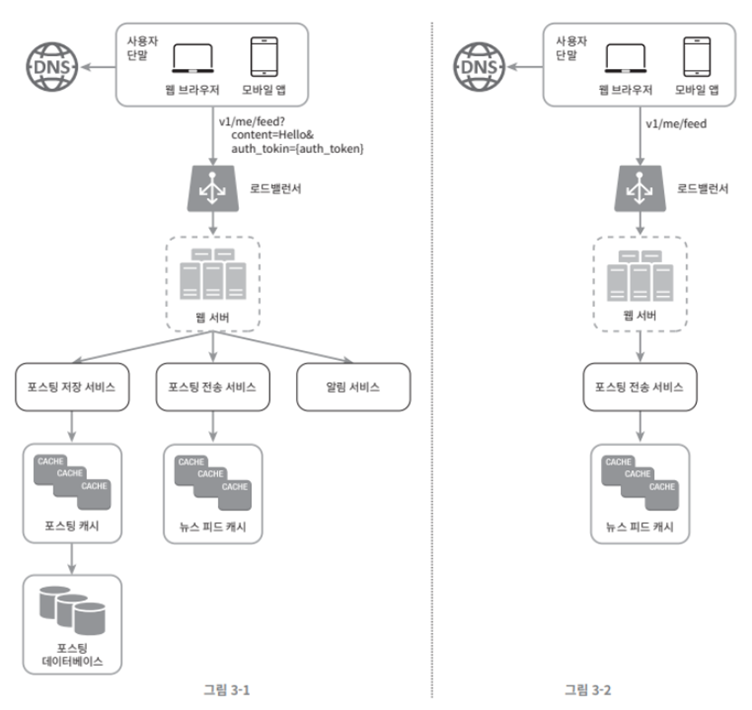

# 003.A Framework For System Design Interviews

## Step 1: Understand the problem and confirm the design scope

It is important to fully understand the requirements.

Think deeply and ask questions to clarify requirements and assumptions.

### Example

Requirements: News feed system design

- Which should I support: mobile app or web app?
- What are the most important features?
- Should news feeds be sorted in descending order? Or are there special sorting criteria? Should each post on the feed be given different weight?
- How many users can a user be friends with?
- How much traffic comes to the site?
- Should be able to upload images or videos to the feed? Or just post text?

## Step 2: Present a rough design and obtain consent

- Present an initial blueprint of the design and solicit opinions.
- Draw a diagram containing key components (e.g. client (mobile/web), API, web server, data store, cache, CDN, message queue, etc.)
- Roughly calculate whether the initial design satisfies constraints related to system scale.

### Example

News feed system design can be divided into two processing flows:

- Feed publishing: When a user posts a post, related data is recorded in the cache/database. It will appear in the news feed of that user's friends.
- Feed creation: Some users' news feeds are created by sorting their friends' posts in descending order.

## Step 3: Detailed Design

Prioritizes design target components and explains details of specific system components in depth

### Example

The rough design of the news feed system has been completed. Therefore, you need to delve deeper into publishing feeds and retrieving news feeds.

## Step 4: Finishing

You can answer follow-up questions or discuss further on your own.

- Find system bottlenecks or points that can be improved (critical thinking skills)
- Summarize the design once again to refresh the interviewer’s memory.
- Consider what happens when an error occurs (server error, network failure, etc.)
- Discuss operational issues. Metric collection, monitoring, logs, system deployment
- Describe how you will address future scale-up needs
- Suggest detailed improvements