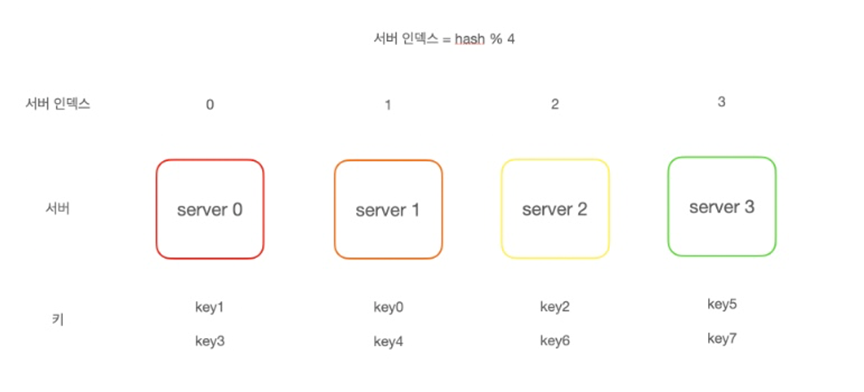

# 005.Design Consistent Hashing

Split requests or data evenly across servers for horizontal scalability

## The Rehashing Problem

When there are N cache servers, a hash function is used to evenly distribute the load across these servers.
serverIndex = hash(key) % N (N is the number of servers)

### Example

When using a total of 4 servers, calculate the hash value and server index for each key. If the calculated server index value is 1, the client connects to server 1 and accesses data.

### Poblem

- This method only works well when the size of the server pool is fixed. Problems arise when servers are added or existing servers are deleted.
- For example, there were a total of 4 servers, but if server 1 fails and stops operating, the size of the server pool changes from 4 to 3. As a result, the server index value will be different, and the cache client will access the wrong server, resulting in a large-scale cache miss.

## Consistent hash

- Consistent hash is a technology that solves the above problem.
- Hashing technology that rearranges only k/n keys when the hash table size is adjusted (k = number of keys, n = number of slots)

### Hash space and hash ring

- Consistent hash uses the concept of a hash ring, which has a hash space and bends and folds both sides of this hash space.
- SHA-1 is used as the hash function, and the output value range is x0, x1, x2, … Assume it is equal to xn
- The hash space range of SHA-1 is known to be from 0 to 2160-1, so x0 is 0, xn is 2160-1, and the remaining values from x1 to xn-1 will be in between.

### Hash Server

Using this hash function, a server IP or name can be placed at a specific location on this ring.

### Hash key

The keys to be cached, key0, 1, 2, and 3, can be placed in the hash ring.

### Server search

- The server where the key is stored is the first server encountered while searching the ring clockwise from the location of the key.
- key0 is stored in server 0, key1 is stored in server 1, and key 2 is stored in server 2.

### Add and remove servers

- With consistent hashes, even if you add or remove servers, you only need to relocate some of the keys, not all of them.
- For example, even if server 4 is added, only key0 is relocated to server 4 and the remaining keys are not affected.

## Problems with consistent hash implementation

### The basic procedure of the stable hash algorithm is as follows.

1) Place servers and keys in a hash ring using a uniformly distributed hash function.

2) Search the ring clockwise from the key's location and the first server encountered is the server where the key will be stored.

### There are two problems with this approach.

1) Partitions cannot be sized evenly

When servers are added or deleted, some servers may be allocated a very small hash space, while others may be allocated a very large hash space.

2) Equal distribution of key is difficult

While Server1 and Server3 will have no data, most of the keys will be stored on Server2.

## Virtual node

- Virtual nodes can solve the above problems
- One server can have multiple virtual nodes on the ring.
- To place server 0 in the ring, instead of using only s0, three virtual nodes are used: s0_0, s0_1, and s0_2.
- Also, when placing server 1 in the ring, three virtual nodes: s1_0, s1_1, and s1_2 are used.
- Search the ring clockwise from the key's location and the first virtual node encountered is the server where the key will be stored.
- As the number of virtual nodes increases, the distribution of keys can become increasingly even.
- However, as the number of virtual nodes increases, more space is needed to store virtual node data. Therefore, the number of virtual nodes must be adjusted appropriately.

## Advantages of consistent hash

- Minimizes the number of keys that are relocated when servers are added or deleted
- Since data is distributed more evenly, it is easier to achieve horizontal scalability.
- Reduces hotspot key problems
- Hotspot key problem: If access to a specific shard is too frequent, server overload problems may occur, but consistent hash distributes data more evenly, reducing the possibility of such problems occurring.

Image files refer to the following: [https://thalals.tistory.com/392](https://thalals.tistory.com/392)