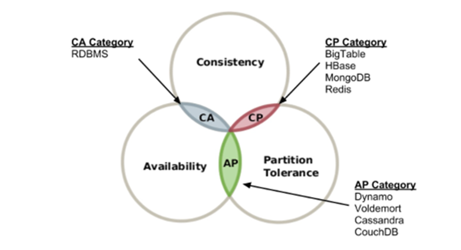

# 006.Design A Key-value Store

- Key-value stores are non-relational databases
- Values stored in this storage must have a unique identifier as a key.
- This connection between a key and a value is called a “key-value” pair.
- The key must be unique, and the value attached to that key can only be accessed through the key.

## Requirements

1) The size of the key-value pair is less than 10KB.

2) Must be able to store large data.

3) Must provide high availability. Therefore, the system must respond quickly even if there is a failure.

4) Must provide high scalability. Therefore, servers must be added/deleted automatically according to the traffic volume.

5) The level of data consistency must be adjustable.

6) Response latency should be short.

## Single server key-value store

- All key-value pairs can be stored in memory as a hash table.
- However, although this approach guarantees high speed, it is impossible to keep all data in memory.
- Therefore, data should be compressed or only frequently used data should be stored in memory and the rest should be stored on disk.

## Distributed key-value store

To store a lot of data, you need to create a distributed key-value store.

### CAP theorem

- The CAP theorem states that it is impossible to design a distributed system that simultaneously satisfies the three requirements of data consistency, availability, and partition tolerance.
- The CAP theorem means that to satisfy any two of these, one must be sacrificed.

1) Data consistency

All clients connecting to a distributed system should always see the same data, regardless of which node they are connected to.

2) Availability

Clients connecting to a distributed system must always be able to receive a response even if some nodes fail.

3) Partition Tolerance theorem

A partition means that a communication failure has occurred between two nodes. Partition tolerance means that the system continues to operate even if a partition is created on the network.

Key value storage can be classified as follows depending on which two conditions it satisfies:

1) CP system: key value store supporting consistency and partition tolerance. Sacrifices availability.

2) AP system: Key value storage supporting availability and partition tolerance. Sacrifices data consistency.

3) CA system: key value store supporting consistency and availability. Partition tolerance is not supported.

However, since distributed systems must be designed to tolerate partitioning problems, CA systems do not exist in the real world.

### CAP example

- Suppose there are distributed servers n1, n2, and n3. Assume that server n3 is paralyzed.
- Because n3 cannot communicate with n1 and n2, the data recorded in n1 and n2 are not delivered to n3, and the latest data in n3 is not delivered to n1 and n2.
- When selecting consistency (CP system): Write operations on n1 and n2 servers must be stopped to avoid data inconsistency. However, in this case, the availability of the server is broken. Banking systems have this characteristic because they do not compromise data consistency.
- When selecting availability (AP system): Even if old data is returned, read operations are still supported. Write operations for n1 and n2 are still supported, and new data is sent to n3 after the partition problem is resolved.

---

# Key-value store core components

data partition

Data multiplexing (replication)

Consistency

Inconsistency resolution

Failure handling

system architecture diagram

write path

read path

## Data partition

- Splitting data into small partitions and then storing them on multiple servers
- Important points when dividing data into partitions

1) Can data be distributed evenly across multiple servers?

2) Can data movement be minimized when nodes are added or deleted?

→ This partition problem can be solved by using a consistent hash.

Advantages of partitioning data using consistent hashes

1) Auto scaling: Servers can be automatically added or deleted depending on system load.

2) heterogeneity: The number of virtual nodes can be adjusted to suit the capacity of each server.

## Data multiplexing

- To ensure high availability and stability, data needs to be multiplexed asynchronously across N servers.
- **The way to select N servers is to place a key on a hash ring, then traverse the ring clockwise to that point and keep a copy of the data on the first N servers you encounter.**
- However, if virtual nodes are used, the number of actual physical servers to which the selected N nodes will correspond may be smaller than N.
- To avoid this problem, when selecting nodes, avoid selecting the same physical server twice.
- Since nodes belonging to the same data center are likely to experience problems such as power outages, network issues, and natural disasters at the same time, a copy of the data is stored on a server in another center, and the centers are connected through a high-speed network.

## Data Consistency

- Data multiplexed across multiple nodes must be properly synchronized.
- When data is distributed and stored across multiple nodes, consistency can be guaranteed for both read and write operations by using the Quorum Consensus protocol.

*Quorum refers to the minimum number of votes that a distributed transaction must obtain to perform work in a distributed system.

N = number of copies

W = Quorum for write operation. For a write operation to be considered successful, it must receive responses from at least W servers indicating that the write operation was successful.

R = Quorum for read operations. For a read operation to be considered successful, it must receive responses from at least R servers.

- The picture above is an example of N=3 and storing val1 in servers s0, s1, and s2 through key1.
- **W=1 means that in order to determine that the write operation was successful, the coordinator must receive a write success response from at least one server.**
- **Therefore, if a success response is received from s1, there is no need to wait for responses from s0 and s2.**
- The coordinator acts as a proxy between the client and the node. It is the node that receives the client’s read/write request
- When W=1 or R=1, the coordinator only needs to receive a response from one server, so the response speed is fast.
- If the value of W or R is greater than 1, the level of data consistency will improve, but the response speed of the coordinator will be slow because it must wait for a response from the slowest server.
- If W + R > N, strong consistency is guaranteed

R = 1, W = N: System optimized for fast read operations

W = 1, R = N: System optimized for fast write operations

W + R > N: Strong consistency is guaranteed

W + R <= N: strong consistency not guaranteed

## Consistency model

Determine the level of data consistency

1) Strong consistency

- All read operations return the most recently updated result.
- Clients do not see old data properly.
- Prohibits reading/writing of the data until the results of the write operation are reflected in all copies.
- Not suitable for high availability systems because processing of new requests is interrupted.

2) Weak consistency

- Read operations may not return the most recently updated results.

3) Eventual consistency

- A form of weak consistency, where updates are eventually reflected in all copies
- If write operations occur in parallel, the consistency of values stored in the system may be broken, and this problem must be resolved by the client.

# Data Versioning

- A technique that can resolve inconsistency problem.
- How to use data version information on the client side to avoid reading inconsistent data
- Technology to solve the problem of inconsistent between copies

1) Versioning

- Creating a new version of the data every time it changes
- Example: How data consistency is broken

- Copies of the data are kept on nodes n1 and n2.
- However, Server 1 changes the value attached to “name” to “johnSanfrancisco”, and Server 2 changes it to “johnNeywork”.
- If these two operations are performed at the same time, you will have two conflicting values. (v1 and v2)
- To solve this problem, a versioning system is needed to detect and automatically resolve conflicts.
- Vector clock is a technique used to solve this problem.

2) Vector Clock

- **The ordered pair of [server, version] is attached to the data.**
- Used to determine which version is the previous version, which version is the latest version, and whether there is a conflict with another version.

1) The client records data D1 in the system. The server that processed this operation is Sx. The vector clock changes to D1([Sx, 1])

2) Another client reads data D1, updates it to D2, and then writes it. D2 overwrites D1. At this time, assuming that the write operation is processed by the same server Sx, the vector clock is changed to D2([Sx, 2]).

3) Another client reads D2, updates it to D3, and then records it. Assuming that this write operation is handled by Sy, the vector clock state changes to D3([Sx, 2], [Sy, 1])

4) Another client reads D2, updates it to D4, and then records it. Assuming this write operation is handled by Sz, the vector clock state changes to D4([Sx, 2], [Sz, 1])

5) When a client reads D3 and D4, it realizes that there is a conflict between data. This is because D2, Sy and Sz have been changed to different values. This conflict is recorded on the server after it is resolved by the client. Assuming that the server that processed this write operation was Sx, the vector clock changes to D5 ([Sx, 3], [Sy, 1], [Sz, 1])

Using a vector clock, you can easily determine which version X is before version Y.

### Disadvantages of Vector Watch

- Conflict detection and resolution logic must be placed in the client, making client implementation complicated.
- The number of ordered pairs in [server:version] increases very quickly.

---

## Failure handling

## Fault detection

- In a distributed system, even if server A dies, server A's failure is not handled immediately.
- Only when two or more servers equally report the failure of server A, it is considered that a failure has actually occurred in that server.
- Establishing a multicasting channel between all nodes is the easiest way to detect server failure.
- However, it is inefficient when there are many servers.

### Gossip protocol

- Gossip protocol is more efficient distributed failure detection solution
- Each node maintains a membership list. The membership list is a list of pairs of each member ID and its heartbeat counter.
- Each node periodically increases its beat counter
- Each node periodically sends its beat counter list to randomly selected nodes.
- The node that receives the beat counter list updates the membership list with the latest value.
- If the beat counter value of a member is not updated for a specified period of time, the member is considered to be offline.
- 

- Node s0 has a membership list like the table on the left of the figure.
- Node s0 discovers that the beat counter of node s2 (member ID=2) has not been incremented for a long time.
- Node s0 passes the list of beat counters containing node s2 to another randomly selected node.
- Any node that discovers that the beat counter of node s2 has not increased for a long time marks that node as a failed node.

## Managing temporary failures

- A system that detects a failure through the gossip protocol must take necessary measures to ensure availability.
- Using a strict quorum approach, read and write operations should be prohibited.
- A sloppy quorum approach relaxes this condition and increases availability.

→ Instead of enforcing a quorum requirement, W healthy servers to perform write operations and R healthy servers to perform read operations are selected from the hash ring.

→ Requests to a server in a disabled state are temporarily handled by another server.

→ **Changes that have occurred in the meantime are reflected in batches when the server is restored to preserve consistency.**

→ A hint is left on the server that temporarily processed the write operation (hinted handoff technique).

## Managing permanent failures

- Synchronize copies by implementing an anti-entropy protocol
- Includes the process of comparing copies and updating them to the latest version
- Uses Merkle tree to detect broken consistency between copies and reduce the amount of transmitted data.

### Merkle tree

- It is a tree in which each node is labeled with a hash of the value stored in its child nodes, or a hash value calculated from the labels of the child nodes.
- The contents of large-scale data structures can be verified in a secure manner.

1) Divide the key space into buckets

2) Calculate the hash value **by applying the uniform distribution hash function to each key** included in the bucket.

3) After calculating the hash value for each bucket, **create a node with the hash value as a label**.

4) Calculate new hash values from the labels of child nodes and construct the binary tree from the bottom up.

- Comparison of these two Merkle trees begins by comparing the hash value of the root node.
- **If the hash value of the root node matches, the two servers have the same data.**
- In other cases, **the hash value of the left child node is compared and the hash value of the right child node is compared**.
- **If you navigate downward like this, you can find buckets with different data and only need to sync those buckets**.
- Git uses Merkle tree for version control.

## Data center failure handling

Because data center failures can occur for a variety of reasons, it is important to have redundancy across multiple data centers.

---

## System architecture diagram

- The client communicates with two simple APIs provided by the key-value store: get(key) and put(key, value).
- A coordinator is a node that acts as a proxy for key-value storage to clients.
- Nodes are distributed on a hash ring of consistent hash.

- The system is completely decentralized so that nodes can be added/deleted automatically.
- Data is multiplexed across multiple nodes
- Since all nodes have the same responsibility, there is no SPOF (Single Point of Failure

Since we adopted a fully distributed design, all nodes must support all functions presented in the figure below.

- Client API
- Fault detection
- Data conflict resolution
- Failover mechanism
- Multiplexing
- Storage engine

## Write path

What happens when a write request is delivered to a specific node?

1) Write requests are logged in the commit log file

2) Data is written to the memory cache

3) When the memory cache is full or reaches a threshold, data is written to the SSTable on disk. SSTable is an abbreviation for Sorted-Srting Table, and is a table that manages ordered pairs of <key, value> in the form of a sorted list.

## Read Path

- The node that receives the read request first checks whether the data is in the memory cache.
- If it is in memory, return the data to the client.
- If it is not in memory, it must be retrieved from disk. An efficient way to find out which SSTable contains the key you are looking for is a Bloom filter.
- 

1) Check whether data is in memory. If not, go to 2

2) Since the data is not in memory, check the bloom filter

3) Find out which SSTable the key is stored in through Bloom filter.

4) Import data from SSTable

5) Return the data to the client

## finish

The functions that a distributed key-value store must have and the technology used to implement those functions.

- Large-scale data storage: load distribution across servers using consistent hash
- Ensure high availability for read operations: multiplex data across multiple data centers
- Ensure high availability for write operations: conflict resolution using versioning and vector clocks
- Data partition: consistent hash
- Progressive scale scalability: consistent hash
- Heterogeneity: consistent Hash
- Adjustable data consistency: quorum consensus
- Temporary failure handling: Sloppy quorum protocol and hinted handoff
- Permanent failure handling: Merkle tree
- Data center failure response: data multiplexing across multiple data centers