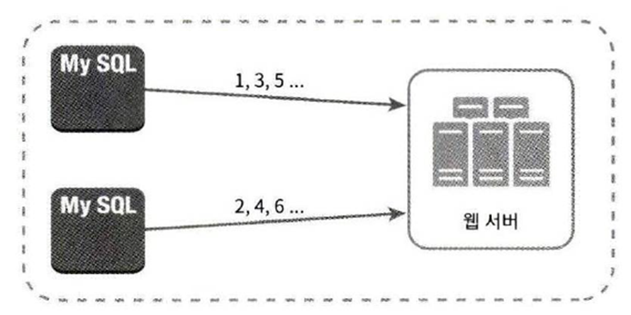

# 007.Design A Unique Id Generator In Distributed Systems

- How to design a unique ID generator to be used in a distributed system
- Wouldn't it be possible to use the primary key of a relational database with the auto_increment property set? You might think, but this approach doesn't work in a distributed environment.
- This is because it is very difficult to lower the delay when using multiple database servers.

## multi master replication

- Multi-master replication utilizes the database's auto_increment function, but instead of incrementing the next ID value by 1, it increments it by k.
- k is the number of database servers currently in use
- This can solve the scalability problem to some extent, but it has its drawbacks.

## Multi-master replication key disadvantages

- Difficult to scale across multiple data centers
- The uniqueness of the ID is guaranteed, but its value cannot be guaranteed to grow over time.
- It is difficult to make it work well when adding or deleting servers.

## UUID

- UUID is a 128-bit number that uniquely identifies information stored in a computer system.

## UUID Advantages

- It is simple to make. There is no need for coordination between servers, so there are no synchronization issues.
- Since each server creates its own ID, it is easy to scale up.

## UUID Disadvantages

- ID is 128 bits, so it is long.
- IDs cannot be sorted chronologically
- ID may contain non-numeric values

## **Ticket Server**

Use only **one centralized database server with auto_increment function**, that is, ticket server.

## Advantages of ticket server

- You can easily create an ID consisting of only numbers and guaranteed uniqueness.
- Easy to implement and suitable for small and medium-sized applications

## Disadvantages of ticket server

- Ticket server becomes SPOF (Single-Point-of-Failure)
- If this server fails, all systems using that server will be affected.
- To solve this problem, multiple ticket servers must be prepared, which creates new problems such as data synchronization.

## Twitter’s snowflake approach

- Twitter uses a unique ID generation technique called snowflake.
- Before creating an ID, let’s divide and conquer first.

### Let’s divide the structure of the ID that needs to be created into several sections and look at the use of each section.

1) Sign bit: Allocate 1 bit. It has no use right now, but we'll save it for later. It can be used to distinguish between negative and positive numbers.

2) Timestamp: Allocate 41 bits. This value indicates how many milliseconds have passed since the origin time (epoch).

3) Data center ID: Allocate 5 bits. Therefore, 2^5 = 32 data centers can be supported.

4) Server ID: Allocate 5 bits. Therefore, 32 servers can be used per data center.

5) Serial number: Allocate 12 bits. Each server increases this serial number by 1 each time it generates an ID. This value is initialized to 0 every time 1 millisecond elapses.

## Detailed design

- Data center ID and server ID are determined when the system starts and do not change during system operation.
- The timestamp or serial number is a value created while the ID is being created.

## Time stamp

- Occupies the most important 41 bits in the ID structure
- **Timestamps have increasingly larger values as time passes, so IDs can eventually be sorted in chronological order.**
- UTC time can be extracted in the form of a binary representation of the value that follows the ID structure, and when applied conversely, UTC time can also be converted to a timestamp value.

- The maximum value of a timestamp that can be expressed in 41 bits is 2^41 - 1 = 2199023255551 milliseconds.
- This value corresponds to approximately 69 years
- Therefore, this ID generator only operates properly for 69 years.

## Serial Number

- Since the serial number is 12 bits, it can have 2^12 = 4096 values.
- Has a value greater than 0, only if a server generated more than one ID in the same millisecond.

## Finish: Additional things to consider

1) clock synchronization

- We assumed that all ID generation servers use the same clock.
- However, this assumption may not be valid when one server runs on multiple cores, or when multiple servers run on multiple physically independent devices.
- A way to solve this problem is NTP (Network Time Protocol).

2) Optimization of the length of each section

- For example, in applications with low concurrency and long lifespan, it may be effective to shorten the serial number clause and increase the length of the timestamp clause.

3) High availability

- The ID generator is a mission critical component and will therefore need to provide very high availability.