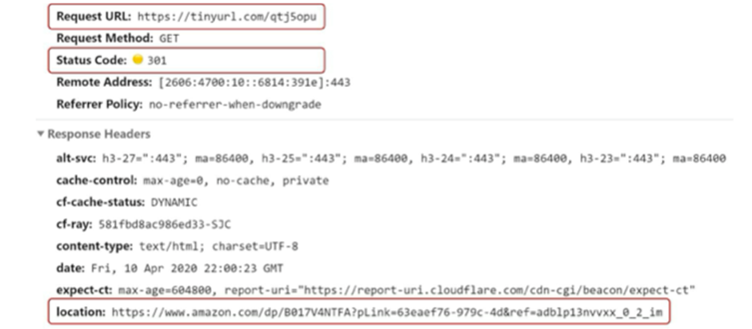

# 008.Design A Url Shortener

# Basic functions of URL shortener

- URL Shortening: Shortens a given long URL to a much shorter length.
- URL redirection: When an HTTP request is made with an shortened URL, it is directed to the original URL.
- High availability, scalability, and fault tolerance are required.

# Rough estimate of requirements

- Write operation: Generate 100 million shortened URLs every day
- Write operations per second: 100 million / 24 / 3600 = 1160
- Read operation: Assuming that the ratio of read and write operations is 10:1, read operations occur 11,600 times per second.
- Assuming that the URL shortener service is operated for 10 years, 100 million * 365 * 10 = 365 billion records must be stored.
- Assume the average length of URL before shortening is 100.
- Therefore, the storage capacity needed for 10 years is 365 billion * 100 bytes = 36.5TB.

## API endpoint

- The client communicates with the server through the API endpoint provided by the server.
- Endpoints will be designed in REST style

1) Endpoint for **URL shortening**

- A client that wants to create a new shortened URL must send a POST request to this endpoint with the URL to be shortened as an argument.

POST /api/v1/data/shorten

- Argument: {longUrl: longURLstring}
- Returns: Shortened URL

2) Endpoint for **URL redirection**

- When an HTTP request comes for a shortened URL, it is an endpoint used to send it to the original URL.

GET /api/v1/shortUrl

- Returns: The original URL that will be the HTTP redirect destination.

## URL redirection

- When you enter a shortened URL in the browser, the server that received the shortened URL changes the URL to the original URL and returns a **301 response** with a Location header.

### Difference between 301 response and 302 response

1) 301 **Permanently** Moved

- This means that responsibility for processing HTTP requests for that URL has been **permanently transferred to the URL returned in the Location header**.
- **The browser caches this response**. Therefore, when a request needs to be sent to the same shortened URL later, the browser sends the request to the original cached URL.
- Used when **reducing server load** is important

2) 302 Found

- This means that requests to that URL should be **temporarily handled** by the URL specified by the Location header.
- **The client's request must always be sent first to the shortened URL server** and then redirected to the original URL.
- Used when **traffic analysis is important** (more advantageous for tracking click rate and location)

### Hash Table

- The most intuitive way to implement URL redirection is to use a hash table.
- If the pair of <shortened URL, original URL> is stored in the hash table, URL redirection is implemented as follows.

Original URL = hashTable.get(shortened URL)

Put the original URL in the 301 or 302 response Location header and send

## URL shortening

When a shortened URL has the form www.tinyurl.com/{hashValue}, the important thing is **to find a hash function that will match the original long URL** with a hash value.

This hash function must meet the following requirements:

- If the long URL given as input has a different value, the hash value must also be different.
- The calculated hash value must be able to be restored to the long URL originally given as input.

# detailed design

**1) Data model**

- The rough design puts everything in a hash table.
- This approach is difficult to use in real systems because memory is finite and expensive.
👉 A better way is to store ordered pairs of <shortened URL, original URL> in a relational database.
- The important columns in this table are id, shortURL, and longURL.

**2) Hash function**

- This is a function that converts the original URL into a shortened URL.
- **The shortened URL value** calculated by the hash function will be referred to as **hashValue**.

### Hash value length

- hashValue consists of characters [0-9, a-z, A-Z]. Therefore, the total number of characters that can be used is 62.
- In order to determine the length of hashValue, you need to find the minimum value of n, which is 62^n ≥ 365 billion (the shorter the length of the shortened URL, the better, so find the minimum value)
- Based on initial requirements, this URL shortening system needs to generate 365 billion URLs.
- The minimum value of n is 7, so the length of hashValue is 7.
- Technologies used to implement hash functions include ‘post-hash collision resolution method’ and ‘base-62 conversion method’.

2-1) Collision resolution after hashing

- To shorten a long URL, you need a hash function that shortens the original URL to a 7-character string.
- Uses well-known hash functions such as CRC32, MD5, and SHA-1.
- Below is the shortened result of https://en.wikipedia.rog/wiki/Systems_design

- However, the shortest hash value calculated by CRC32 is also longer than 7.
- To further reduce this, you can try using only the first 7 letters of the calculated hash value, but this has a high probability that the hash results will conflict with each other.
- Therefore, when a collision actually occurs, a predetermined string is added to the hash value until the collision is resolved.

- This can resolve the conflict, but requires querying the database more than once when creating a shortened URL. Therefore, the overhead is large.
- Performance can be improved by using a bloom filter instead of a database.
- **Bloom filter** is a highly efficient technique that allows you to check whether a certain element exists in a certain set.

2-2) base-62 conversion

- base conversion
- Useful when two systems with different ways of expressing numbers need to share the same number.
- There are 62 characters that can be used in hashValue, so base 62 is used.
- Let’s convert 111517 (decimal) to 62 (base 62)
- Base 62 is a base 62 system that uses a total of 62 characters to represent numbers.
- Therefore, 0 is expressed as 0, 9 as 9, 10 as a, and 61 as Z. • 11157 (decimal) = 2 x 62^2 + 55 x 62 ^1 + 59 x 62 ^ 0 = [2, 55, 59] => [2, T, X] => 2TX (base 62)
- Therefore, the shortened URL becomes https://tinyurl.com/2TX.

### Comparison of two approaches

| Collision resolution after hashing | base-62 conversion |
| --- | --- |
| Shortened URLs have fixed length | The length of the shortened URL is variable. As the ID value increases, it becomes longer as well. |
| No need for a unique ID generator | Requires a unique ID generator |
| Conflicts are possible, so a resolution strategy is needed. | This is a strategy that can be applied only after the uniqueness of the ID is guaranteed, so collisions are completely impossible. |
| Since the shortened URL is not calculated from the ID, it is impossible to find out the URL that can be used next. | Assuming that the ID is a value that increases by 1, it may be a security problem because it is easy to find out what shortened URL can be used next. |

**3) Detailed design of URL shortener**
Let’s do a detailed design using base 62.

3-1. It takes a long URL as input.
3-2. Checks whether the URL exists in the database.
3-3. If it is in the database, the shortened URL for that URL is retrieved from the database and returned to the client.
3-4. If it does not exist in the database, a unique ID is generated. This ID is used as the primary key of the database.
3-5. By applying base 62 conversion, the ID is converted into a shortened URL.
3-6. After creating a new database record with the ID, shortened URL, and original URL, the shortened URL is delivered to the client.

- In the example above, the entered URL is [https://en.wikipedia.org/wiki/Systems_design](https://en.wikipedia.org/wiki/Systems_design).
- The ID returned by the ID generator for this URL is 2009215674938.
- If you convert this ID to base 62, you get zn9edcu.
- The new record in the database created through this is an example of the table above.

4) URL redirection detailed design

- The figure below is the detailed design of the URL redirection mechanism.
- As the system reads more often than writes, the pair of <shortened URL, original URL> was stored in the cache to improve performance.

## Load balancer operation flow

1. The user clicks the shortened URL.
2. The load balancer delivers the request generated by the click to the web server.
3. If the shortened URL is already in the cache, the original URL is immediately retrieved and delivered to the client.
4. If the shortened URL is not in the cache, it is retrieved from the database.
5. Put the URL retrieved from the database into the cache and return it to the user.

# Finish

- Summary: URL Shortener's API, data model, hash function, URL shortening and redirection procedures
- Additional things to think about
- **Rate limiter**
- Can be incapacitated if a huge amount of URL shortening requests are received.
- If you set up a rate limiter, you can filter out requests using filtering rules, including IP addresses.
- **Web server scaling**
- Since the web layer is a stateless layer, web servers can be added or deleted freely.
- **Scaling up your database**
- Scale scalability can be achieved by multiplexing or sharding the database.
- **Data analytics solutions**
- If you integrate a data analytics solution into your URL shortener, you will be able to find out important information such as which links were clicked by how many users and when they were most often clicked.
- **Availability, data consistency, reliability**