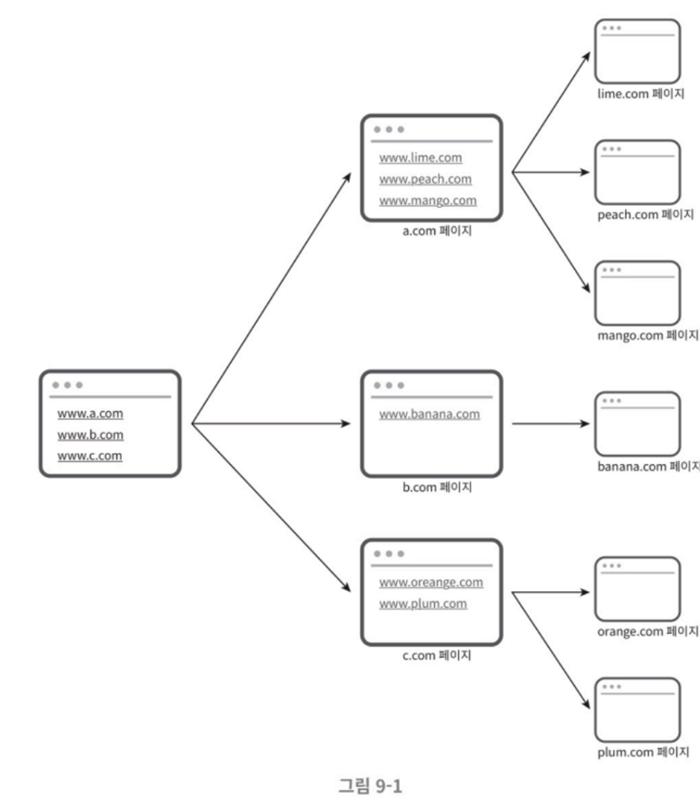

# 009.Design A Web Crawler

# Web crawler

- Web crawlers are also called robots or spiders.
- This is a technology widely used in search engines, and its main purpose is to find new or updated content on the web.
- Content can be web pages, images, videos, PDF files

## Examples of web crawler usage

- **Search Engine Indexing**: Crawlers collect web pages and create a local index for search engines. For example, Google bot is a web crawler used by the Google search engine.
- **Web archiving**: refers to the process of collecting information from the web for long-term storage for future use. Many national libraries run crawlers to archive websites.
- **Web Mining**: Web mining can be used to derive useful knowledge from the Internet.
- **Web monitoring**: You can monitor cases of copyright or trademark infringement on the Internet. For example, Digimarc uses web crawlers to find pirated works.

- The complexity of a web crawler varies depending on the scale of data that needs to be processed.
- Therefore, the first priority in crawler design is to define the size and function of the data.

## Basic algorithm of web crawler

- Given a set of URLs as input, download all web pages pointed to by those URLs.
- Extract URLs from downloaded web pages
- Add the extracted URLs to the list of URLs to download and repeat the above process from the beginning.

## Characteristics a web crawler should have

- **Scalability**: Since there are billions of pages on the web, utilizing parallelism will allow for more effective web crawling.
- **Robustness**: Must be able to deal with abnormal inputs or environments, such as incorrectly written HTML, unresponsive servers, errors, and links with malicious code.
- **Politeness**: Do not send too many requests to the collection target website in a short period of time.
- **Extensibility**: It should be easy to support new types of content. For example, if you suddenly want to crawl image files as well, you need the flexibility to expand slightly rather than redesign the entire system.

## Rough size estimation

### Query calculation amount

- 1 billion web pages are downloaded every month.
- QPS = 1 billion/30 days/24 hours/3600 seconds = approximately 400 pages/second
- Peak QPS = 2 * QPS = 800

### Storage capacity

- Assume the average size of a web page is 500k.
- 1 billion pages * 500k = 500TB/month
- 500 TB to store one month’s worth of data.
- Assuming storage for 5 years, a storage capacity of 500TB * 12 months * 5 years = 30PB is ultimately required.

## Rough design plan

**1) Set of starting URLs**

- A set of starting URLs is the starting point from which a web crawler operates to begin crawling.
- Example: The most intuitive way to crawl all visible web pages from a university website is to use the URLs of all pages with the university's domain name as the starting URL.
- If you need to crawl the entire web, you should choose a starting URL that allows you to explore as many links as possible.

👉🏻 A strategy is used to divide the entire URL space into small subsets.

👉🏻 Use a different starting URL for each topic. (Segmented into shopping, sports, health, etc.)

**2) Uncollected URL storage**

- Most modern web crawlers manage crawling status by dividing it into two categories: (1) URL to be downloaded, and (2) downloaded URL.
- Uncollected URL storage (URL frontier) is a component that stores and manages ‘URLs to download’.

**3) HTML Downloader**

It is a component that downloads web pages from the Internet.

**4) Domain Name Converter**

- To download a web page, you need to convert URL to IP.
- HTML Downloader uses a domain name converter to handle this.

**5) Content parser**

- When you download a web page, you must go through parsing and validation procedures.
- The reason the content parser is made as an independent component is because if implemented within the crawl server, the crawling process slows down.

**6) Is it duplicate content?**

- Approximately 29% of web page content is duplicated. Therefore, the same content may be saved multiple times.
- By introducing a data structure to solve this problem, data duplication is reduced and the time required for data processing is reduced.
- Makes it easy to identify content already stored in the system
- To effectively compare two HTML files, you can compare the hash values of the web pages.
- Comparing two files by viewing them as strings is slow and inefficient when the number of documents is large.

**7) Content storage**

- Content repository is a system that stores HTML documents.
- We will choose a storage that uses both disk and memory.
- Because the amount of data is so large, most of the content is stored on disk.
- Popular content will be stored in memory to reduce access latency.

**8) URL extractor**

- The URL extractor parses the HTML page and selects links.
- Convert all relative paths to absolute paths.

**9) URL filter**

- Exclude the following URLs from crawling
- URLs with specific content types or file extensions
- URL that causes an error when accessing
- URLs included in the access exclusion list (deny list)

**10) URL already visited?**

- To prevent processing the same URL multiple times, we will use a ‘Bloom filter’ or ‘hash table’ data structure that can track the URLs below.
- Reduces server load and prevents the system from falling into an infinite loop.
- Already visited URL storage
- Uncollected URL storage

**11) URL storage**

- This is a storage that stores URLs that have already been visited.

## Workflow of web crawler

1) Save the starting URLs in the uncollected URL storage.

2) HTML Downloader retrieves a list of URLs from the uncollected URL repository.

3) HTML Downloader uses a domain name converter to find the IP address of the URL, connects to that IP address, and downloads the web page.

4) The content parser parses the downloaded HTML page and verifies whether the page has the correct format.

5) Check for duplicate content.

6) To check for duplicate content, see if the page is already in the repository.

- If the content is already in the repository, it is discarded without processing.
- If the content is not in the repository, it is saved in the repository and then delivered to the URL extractor.

7) URL extractor picks out links from the corresponding HTML page.

8) Pass the selected links to the URL filter.

9) After filtering is completed, only the remaining URLs are passed to the duplicate URL determination step.

10) To check whether the URL has already been processed, check whether the URL is stored in the URL storage. If it's already in the repository, discard it.

11) URLs not in the repository are sent to the URL repository and the uncollected URL repository.

## Detailed design

- DFS vs BFS
- Uncollected URL storage
- Stability assurance strategy
- Strategies to secure scalability
- Problematic content detection and avoidance strategies;

### 1) Should I use DFS or BFS?

- The web is like a directed graph. A page is a node, and a hyperlink is an edge.
- The crawling process is the process of exploring this directed graph along its edges.
- DFS and BFS are widely used algorithms for graph search.
- In DFS (depth-first search), if the graph is large, it is difficult to estimate how deep it will go.
- Therefore, web crawlers usually use BFS.
- BFS (breadth-first search) is an algorithm that uses a FIFO (First-In-First-Out) queue.
- Just **insert the searched URL into one side of this queue and take it out from the other side**.

### Two problems with BFS

1-1) Many of the links from one page go back to the same server.

- All links extracted from wikipedia.com pages are internal links, that is, links that refer to other pages on the same wikipedia.com server.
- Eventually, the crawler gets busy downloading many links belonging to the same host.
- If the links are processed in parallel, the Wikipedia server will be overloaded with numerous requests.
- These crawlers are considered ‘impolite’ crawlers.

1-2) The standard BFS algorithm does not give priority to URLs.

- This means that all pages are treated equally in the processing order.
- But not all web pages have the same level of quality or the same level of importance.
- Priority levels must be distinguished based on various measures such as page rank, amount of user traffic, and update frequency.

### 2) Uncollected URL storage

- This problem can be handled more easily by using uncollected URL storage.
- URL storage is ‘a place to store URLs to download’
- If you implement this repository well, you can implement a crawler with ‘politeness’ and a crawler that distinguishes priority and freshness between URLs.

**2-1) Politeness**

- Web crawlers should refrain from sending too many requests to the collection target server in a short period of time.
- To make the crawler polite, it should request only one page from the same website at a time. Tasks that download pages from the same website are executed at different times.
- To satisfy the above requirements, you only need to maintain the **relationship between the website's hostname and the worker thread** that performs the download.
- Each download thread has a separate FIFO queue, so only URLs taken from the queue are downloaded.

- Queue Router: It ensures that **URLs belonging to the same host always go to the same queue**.
- Mapping table: This is a table that stores the relationship between host names and queues.
- FIFO queue: URLs belonging to the same host are always stored in the same queue.

- Queue selector: It traverses the queues, retrieves a URL from the queue, and delivers the URL from the queue to the designated work thread to download it.
- Worker thread: Performs the task of downloading the delivered URL. The delivered URLs will be processed sequentially, and there can be a certain delay between tasks.

**2-2) Priority**

- A page on a forum where user opinions about Apple products are posted and the Apple homepage have different levels of importance.
- Although ‘Apple’ appeared as a keyword in both cases, the crawler should collect the more important page, that is, Apple’s homepage first.
- When prioritizing URLs according to usefulness, various measures such as PageRank, amount of traffic, and update frequency can be used.
- A prioritizer is a component that determines the priority of URLs.

- Ranking device: Receives URL as input and calculates priority.
- Queue: One queue is allocated for each priority. The higher the priority, the higher the probability of being selected.
- Queue selector: Responsible for selecting URLs to be processed from a random queue. It is designed to be pulled more frequently from queues with higher rankings.

### The overall design reflects this

- Front queue: handles the priority decision process.
- Back queue: Ensures that the crawler operates politely.

**2-3) Freshness**

- Web pages are added, deleted, and changed from time to time.
- In order to maintain the freshness of data, it is necessary to periodically recrawl even pages that have already been downloaded.
- However, a strategy is needed to avoid re-collecting all URLs.
- Utilize web page update history
- Use priority to re-collect important pages more frequently

**2-4) Persistent storage device for uncollected URL storage**

- In the case of crawlers for search engines, the number of URLs that must be processed reaches hundreds of millions.
- Keeping all of them in memory is not desirable in terms of stability or scalability.
- Saving everything to disk is also not good because it is slow and can easily become a performance bottleneck.
- A hybrid approach is to keep most URLs on disk, but queue them in a memory buffer to reduce IO costs.
- Data in the buffer will be periodically written to disk.

### **3) HTML Downloader**

- HTML Downloader downloads web pages through the HTTP protocol.

**3-1) Robots.txt**

- Robot exclusion protocol
- This is the standard way for websites to communicate with crawlers.
- This file contains a list of pages that can be collected by the crawler.
- Therefore, before a web crawler scrapes a website, the crawler must first check the rules listed in the file.
- To avoid constantly downloading the Robots.txt file, this file will be re-downloaded periodically and stored in the cache.
- Looking at Amazon's Robots.txt (https://www.amazon.com/robots.txt) file as an example, the following rules are listed. You can see that the contents of the directory below cannot be downloaded.

User-agent: Googlebot

Disallow: /creatorhub/

Disallow: /rss/people/reviews*

Disallow: /gp/pdp/rss/reviews

Disallow: /gp/cdp/member-reviews

Disallow: /gp/aw/cr

**3-2) Performance optimization**

**3-2-1) Distributed crawling**

- This is a method of distributing crawling work across multiple servers to increase performance.
- Each server runs multiple threads to process download tasks.
- The URL space is divided into small units, and each server is responsible for downloading a portion of them.

**3-2-2) Domain name conversion result cache**

- Domain name resolver (DNS Resolver) is one of the bottlenecks in crawler performance.
- This is due to the synchronous nature of sending DNS requests and receiving results.
- You cannot proceed with the next task until you receive the result of the DNS request.
- It usually takes 10ms to 200ms for a DNS request to be processed.
- Therefore, performance can be effectively improved by storing the relationship between the domain name and IP address obtained as a result of DNS lookup in a cache and updating it periodically by running a cron job.

**3-2-3) Regionality**

- This is a method of distributing servers that perform crawling tasks by area.
- If the crawling server is geographically close to the crawling target server, the page download time will be reduced.

**3-2-4) Short timeout**

- Some web servers respond slowly or do not respond at all.
- The maximum amount of time to wait is set in advance, so if the server does not respond during this time, the crawler stops downloading the page and moves on to the next page.

### **4) Stability**

- Consistent hashing: This is a technology that can be applied when distributing the load across downloader servers. You can easily add and delete downloader servers.
- Storage of crawling status and collected data: It is advisable to record the crawling status and collected data in a persistent storage device so that it can be easily recovered even in the event of a failure. After loading the saved data, you can easily restart interrupted crawling.
- Exception handling: Even if an exception occurs, the entire system must be able **to continue its work gracefully without stopping**.
- Data validation: It is an important means to prevent system errors.

### **5) Scalability**

- Care must be taken to easily support new types of content.
- For example, let's look at a design that can support new types of content by inserting new modules.

- PNG Downloader: A plug-in module that downloads PNG files.
- Web Monitor: A module that monitors the web to prevent copyright or trademark infringement.

### 6) Detection and avoidance of problematic content

Let's look at how to detect duplicate, meaningless, or harmful content and block it from the system.

**6-1) Duplicate content**

- 30% of web content is duplicate.
- Duplicate content can be detected more easily by using a hash or check-sum.

**6-2) Spider trap**

- A spider trap is a web page designed to trap crawlers in an infinite loop.
- For example, let's say you have a link that contains an infinitely deep directory structure like this:
- spidertrapexample.com/foo/bar/foo/bar/foo/bar/foo/bar/foo/bar/foo/bar
- This trap can be avoided by limiting the maximum length of the URL.
- It is the website with this trap installed that has a strangely large number of web pages.
- However, creating an algorithm that automatically avoids traps is tricky.
- Ultimately, after a person manually checks and finds the trap, the site with the trap is excluded from the crawler search target or placed in the URL filter list.

**6-3) Data noise**

- Some content has little value.
- Examples: advertisements, script code, spam URLs
- Such content should be excluded from crawling.

## Things to discuss further

- **Server-side rendering**: Many websites use technologies such as JavaScript and AJAX to dynamically create links. So, if you just download the web page as is and parse it, you will not be able to find any dynamically generated links. This problem can be solved by applying server-side rendering (also called dynamic rendering) before parsing the page.
- **Filtering out unwanted pages**: Since the resources required for crawling, such as storage space, are limited, install an anti-spam component to filter out unnecessary pages.
- **Database replication and sharding**: The availability, scalability, and stability of the data layer can be improved.
- **Horizontal scalability**: Large-scale crawling may require hundreds or thousands of servers to execute downloads. For horizontal scalability, it is important to ensure that **the server does not maintain state information**, that is, to make it a stateless server.
- Availability, consistency, stability
- Data analysis solutions (analytics): collecting and analyzing data