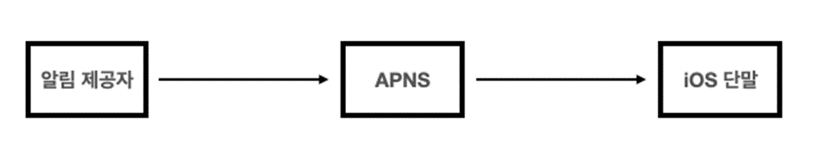

# 010.Design A Notification System

# Notification system

- Application programs equipped with a notification system asynchronously provide important information to customers, such as the latest news, product updates, events, and gifts.
- Can be classified into mobile push notifications, SMS messages, and emails.

## Understand the problem and confirm the design scope

- Must support push notifications, SMS messages, and emails
- Soft real-time system
- Notifications should be delivered as quickly as possible, but if the system is under high load, some delay is acceptable.
- Must support iOS devices, Android devices, and laptops/desktops.
- Notifications can be created by client application programs, or by server-side scheduling.
- Must be able to send 10 million mobile push notifications, 1 million SMS messages, and 5 million emails per day
- Users must be able to configure not to receive notifications (opt-out)

## Support measures for each notification type

**1) iOS push notifications**

Three components for sending push notifications on iOS

- Notification provider:

An entity that creates a notification request and sends it to the Apple Push Notification Service (APNS). To send a notification request, you need the following data

➡️Device token: A unique identifier needed to send a notification request.

➡️Payload: JSON dictionary containing notification contents

- Notification Service (APNS): This is a remote service provided by Apple. It is responsible for sending push notifications to iOS devices.
- iOS device: A user device that receives push notifications.

**2) Android push notifications**

- Android push notifications are sent using a similar process.
- The only difference is that FCM (Firebase Cloud Messaging) is used instead of APNS.

**3) SMS message**

When sending SMS messages, services from third-party providers such as Twilio and Nexmo are often used.

**4) Email**

Commercial email services include Sendgrid and MailChimp.

### Results of grouping notification types into one system

## Contact Information Collection Procedure

- To send a notification, information such as mobile terminal token, phone number, and email address is required.
- When a user installs our app or registers an account for the first time, the API server stores the user's information in the database.
    
    
    
- Below is the data structure to store contact information.
- Email addresses and phone numbers are stored in the user table.
- The terminal token is stored in the device table.

## Procedures for sending and receiving notifications

### 1) Rough design plan (draft)

- **Services 1 to N**: Each of these services may be a microservice, a cronjob, or a distributed system component. For example, billing service that informs you of the due date, delivery notification, etc.
- **Notification system**: The notification system is the core of notification sending/receiving processing. Let's assume that it is a system that uses only one server. This system must provide an API for sending notifications to services 1 to N, and must be able to **create notification payloads to be delivered to third-party services**.
- **Third party service**: Responsible for actually delivering notifications to users. One thing to keep in mind when integrating with third-party services is scalability. It should be easy to integrate new services or remove existing services. Additionally, in the case of a global service, support depending on the country must be considered. For example, FCM is not available in China, so services such as Jpush and PushY must be used in the Chinese market.
- **iOS, Android SMS, email devices**: Users receive notifications on their devices

### Problems with the above design

- **SPOF (Single-Point-Of-Failure)**: The fact that the notification service has only one server means that if that server fails, the entire service will fail.
- **Scalability**: Since everything related to push notifications is handled by one service, there is no way to individually increase the size of important components such as database or cache.
- **Performance bottleneck**: Processing and sending notifications can be a resource-intensive task. If everything is handled by one server, the system can become overloaded during times of high user traffic.

### 2) Improved design

- Separate the database and cache from the main server of the notification system.
- Expand notification servers and enable automatic horizontal scale expansion.
- Break strong coupling between system components using message queues.

- **Services from 1 to N**

Services that will send notifications through the API of the notification system server

- **Role of notification server**

* **Notification transmission API**: To prevent spam, it is usually only available to in-house services or authenticated clients.

* **Notification validation**: Basic validation is performed on email addresses, phone numbers, etc.

* **Database or cache query**: This is a function to retrieve data to be included in notifications.

* **Notification transmission**: Puts notification data into the message queue. In this design, **more than one message queue is used**, so notifications **can be processed in parallel**.

* **Cache**: Cache user information, terminal information, notification templates, etc.

* **Database**: Stores various information such as users, notifications, and settings.

* **Message queue**: Used to remove dependencies between system components. It also serves as a buffer in case a large amount of notifications need to be sent. This design uses **separate message queues** for each type of notification, so **even if a failure occurs in one of the third-party services, other types of notifications operate normally**.

* **Work server (workers)**: A server in charge of pulling notifications to be sent from the message queue and delivering them to a third-party service.

* **Third-party service**

* **iOS, Android, SMS, email terminal**

### Process of notification being sent through the above components

1. Call the API to send a notification to the notification server.
2. The notification server retrieves metadata such as user information, terminal token, and notification settings from the cache or database.
3. The notification server creates an event that matches the notification to be sent and places it in the queue for the event. iOS push notification events must be placed in the iOS push notification queue.
4. The work server pulls out a notification event from the message queue.
5. The work server sends a notification to a third-party service.
6. The third-party service sends a notification to the user terminal.

## Detailed design

### 1) Stability

When designing a notification system to be operated in a distributed environment, several considerations must be taken to ensure stability.

**1-1) Prevent data loss**

It's okay if notifications are delayed or out of order, but notifications should not be lost under any circumstances. To meet this requirement, the notification system must keep notification data in a database and implement a retry mechanism. One way is to maintain a notification log database.

**1-2) Prevent duplicate notification transmission**

It is not possible to completely prevent the same notification from repeating multiple times. Due to the nature of the distributed system, sometimes the same notifications may be sent repeatedly. A duplicate detection mechanism should be introduced and errors should be handled. When a notification to be sent arrives, the event ID is checked to see if it has been previously sent. If it is a duplicate event, it is discarded; otherwise, a notification is sent.

### 2) Additional required components and considerations

**2-1) Notification template**

Large notification systems process millions of notifications per day. However, most of the notification messages have a similar format. Notification templates take these similarities into account, eliminating the need to recreate every part of the notification message from scratch. A notification template is a framework that creates notifications according to a predefined format by simply adjusting the parameters, style, and tracking link.

**2-2) Notification settings**

Users already receive so many notifications that they get tired easily. Therefore, it is necessary to allow users to fine-tune their notification settings. This information is stored in the notification settings table, and before sending a specific type of notification, you must check whether the user has notifications turned on.

**2-3) Transmission rate limit**

A way to avoid sending too many notifications to a user is to limit the frequency of notifications a user can receive. This is because if too many notifications are sent, users may turn off the notification function altogether.

**2-4) Retry method**

If a third-party service fails to send a notification, it places the notification in a dedicated retry queue. If the same problem continues to occur, the developer will be notified. (Example: Slack)

**2-5) Push notifications and security**

For iOS and Android apps, the notification sending API is secured using appKey and appSecret. Therefore, only authenticated or verified clients can send notifications using the API.

**2-6) Queue monitoring**

One important metric when monitoring a notification system is the number of notifications queued. If this number is too large, it means that the job servers are not processing events quickly. In such cases, it would be desirable to expand the work server.

**2-7) Event tracking**

Metrics such as notification open rate, click-through rate, and actual app usage rate are important for understanding your users. Typically, notification systems integrate with data analysis services.

### 3) Modified design plan

Added components

- Notification server authentication and rate-limiting functions
- Retry function to respond to transmission failures. Notifications that fail to be sent are re-queued and retried a specified number of times.
- Transfer template. Simplifies the notification creation process and maintains consistency of notification content.
- Monitoring and tracking system. It was made easy to check the system status and improve the system in the future.

## Finish

Summary of implementation methods and optimization techniques for each component

- Reliability: A reliable retry mechanism was introduced to reduce the message transmission failure rate.
- Security: Mechanisms such as appKey and appSecret were used to ensure that only authenticated clients could send notifications.
- Event tracking and monitoring: In order to track the process from when a notification is created until it is successfully transmitted, and monitor the system status, a system that can track and monitor events at each stage of notification transmission has been integrated.
- User settings: Allows users to adjust notification reception settings. Therefore, the system design was changed to ensure that the settings are checked before sending a notification.
- Transmission rate limit: Allows you to limit the frequency of sending notifications to users.