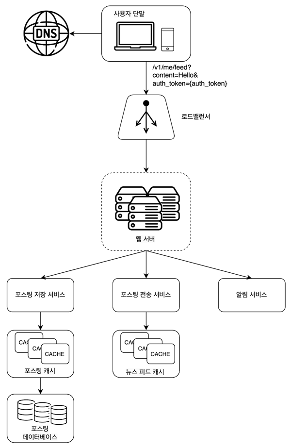

# 011.Design A News Feed System

# What is news feed?

- Stories that are continuously updated in the center of the home page
- User status updates, photos, videos, links, app activity
- People you follow, pages, and likes
- Similar types of problems include Facebook news feed design, Instagram feed design, and Twitter timeline design.

# Understand the problem and confirm the design scope

- Users should be able to post new stories on the news feed page and view stories posted by friends.
- The story must be displayed in reverse chronological order.
- One user can have up to 5000 followers.
- The traffic volume is assumed to be 10 million visitors per day.
- Feeds may include media files such as images or videos.

# Present rough design plan and seek consent

- Let’s divide it into feed publishing and news feed creation.
- Publish feed: When a user posts a story, the data is recorded in the cache and database. New posts are also sent to your friends' news feeds.
- Create a news feed: Create a collection of all your friends' posts in reverse chronological order.

## News Feed API

- The News Feed API is the means clients use to communicate with the server.
- Based on HTTP protocol
- Update your status, get your news feed, add friends, and more.
- Let’s take a look at the feed publishing API and feed reading API.

**1) Feed publishing API**

- API for posting new stories
- Send request in HTTP POST format

➡️ POST /v1/me/feed

➡️ Parameter

- body: Post content
- Authorization header: Used to authenticate API calls.

**2) Feed reading API**

- API to retrieve news feed

➡️ GET /v1/me/feed

➡️ Parameter

- Authorization header: Used to authenticate API calls.

## Publish feed

- User: The entity that posts new posts. Calls the POST /v1/me/feed API
- Load balancer: Distributes traffic to web servers.
- Web server: Sends HTTP requests to internal services.
- Post service: Stores new postings in the database and cache.
- Posting transmission service (fanout service): Push new postings to friends' news feeds. News feed data is stored in cache so that it can be read quickly.
- Notification service: Responsible for notifying friends that new posts have been posted or sending push notifications.

## Generate news feed

Let’s take a look at how the news feed that users see is created.

- User: The subject who reads the news feed. Call the GET /v1/me/feed API.
- Load balancer: Distributes traffic to web servers.
- Web server: Sends traffic to the news feed service.
- News feed service: A service that retrieves news feeds from the cache.
- News feed cache: Stores the feed ID needed when rendering the news feed.

# Detailed design

## 1) Feed publishing flow

### Web Server

- The web server communicates with the client and also performs authentication and rate limiting functions.
- Only users who put the correct authentication token in the Authorization header and call the API should be able to post.
- To prevent spam and prevent harmful content from being uploaded frequently, a limit should be placed on the number of postings a user can make during a certain period of time.

### Posting transmission (fan-out) service

- Posting transmission, or fanout, is the process of delivering a user's new posting to all users who are friends with that user.
- There are two models of fan-out.

### 1-1) Model that fanout-on-write at the time of writing (also called push model)

- Update the news feed when new postings are recorded.
- Once a posting is completed, the post is immediately recorded in the user's cache.
- Advantages
- News feeds are updated in real time and are immediately sent to users on your friends list.
- Posts are sent at the time they are written, shortening the time it takes to read the news feed.
- Disadvantages
- For users with many friends, updating the news feed may take a long time. (hotKey issue)
- Even the feeds of users who do not use the service frequently are updated. Therefore, computing resources are wasted.

### 1-2) Model that fanout-on-read (also called pull model)

- Update the news feed when you need to read it.
- It is an on-demand model
- Bring new posts when the user loads their homepage or timeline
- Advantages
- It is advantageous for inactive users or those who do not use the service frequently. It doesn't consume any computing resources until you log in.
- There is no need to push data to each friend, so there are no hotkey issues.
- Disadvantages
- Reading the news feed can take a lot of time.

### Combining two models

- The push model is applied to most users when retrieving news feeds (so that news feeds can be retrieved quickly)
- In the case of celebrities where hoyket issues may occur, the Pull model is used to prevent system overload.
- There is also a way to reduce the hotkey issue itself, by distributing requests and data evenly through a consistent hash.

### Detailed summary of fanout-on-write service

1. Get a list of friend IDs from the graph database. Graph databases are suitable for managing friendships or friend recommendations.
2. Retrieve friends’ information from the user information cache. Filters out some of your friends based on your settings. For example, if a user chooses to ignore feed updates from one of their friends, that friend's new stories shouldn't appear in the user's news feed.
3. Insert the friends list and the posting ID of the new story into the message queue.
4. The fanout work server pulls data from the message queue and places the news feed data into the news feed cache. (Posting transmission work server)
- News feed cache can be viewed as a mapping table that stores ordered pairs of <posting ID, user ID>.
- Each time a new posting is made, records will be added to this cache.
- All user information and posting information are not stored in the table. In order to keep the memory size at an appropriate level, a limit is placed on the size of this cache.
- It is extremely unlikely that a user will scan all of the thousands of stories. What most users want to see are the latest stories. Therefore, the probability of a cache miss occurring is low.

## 2) Feed reading flow

- The user sends a request to read the news feed. The request will be sent to /v1/me/feed.
- The load balancer sends the request to one of the web servers.
- The web server calls the news feed service to retrieve the feed.
- The news feed service retrieves the list of posting IDs from the news feed cache.
- Create a complete news feed by pulling user names, user photos, posting content, images, etc. to be displayed in the news feed from the user cache and posting cache.
- Send the generated news feed to the client in JSON format. The client renders the feed.

### Cache structure

- News feed: Stores the ID of the news feed.
- Content: Stores posting data. Popular content is stored separately.
- Social graph: Stores relationship information between users.
- Action: Stores information about the user's actions regarding postings. This includes ‘likes’ and replies to posts.
- Counter: Stores information such as number of likes, number of responses, number of followers, number of following.

# Finish

Topics worth covering further

### **Database scale expansion**

- Vertical Scaling vs Horizontal Scaling
- SQL vs NoSQL
- Master-slave database multiplexing
- Read operations on replicas
- Consistency model
- Database sharding

### **Other topics**

- Operating the web-tier in a stateless manner
- How to cache as much data as possible.
- How to support multiple data centers
- Use message queues to reduce coupling between components.
- Monitoring of key metrics. For example, QPS (Queries per Second) during peak traffic times and delay time when users refresh the feed.