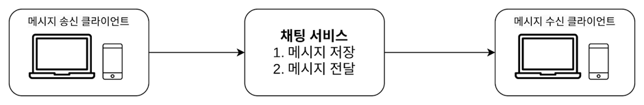

# 012.Design a Chat System

## Understand the problem and confirm the design scope

- 1:1 chat function with low response delay
- Group chat function that allows up to 100 people to participate
- The traffic volume must be able to handle 50 million daily active users (DAU).
- Function to display user’s connection status
- Supports various terminals, supports simultaneous access to multiple terminals with one account
- Push Alarm

## Present rough design plan and seek consent

- For chat systems, the client is a mobile app or a web application
- Clients do not communicate directly with each other
- Each client communicates with the chat service

## Chat service must provide the following functions

- Receive messages from clients
- Determine the message recipient and deliver the message
- If the recipient is not online, the message is stored until the recipient is online.

## Relationship between client and chat service

- A client who wants to start a chat connects to the service using a **network communication protocol**.
- Therefore, which communication protocol to use is also an important issue.
- In this chat system, it is the client that sends the request.
- The sending client uses the **HTTP protocol** when sending a message to the chat service to be delivered to the receiving client.
- **The client connects to the chat service using the HTTP protocol**. Then, send the message to the chat service to have the message sent to the recipient.
- It is efficient to use the **keep-alive header** when connecting to a chat service, because the connection between the client and server can be maintained without disconnecting. Also, The number of **handshakes** that occur during the **TCP connection** process **can be reduced**.
- Services like Facebook also used HTTP early on. However, the message reception scenario is much more complex. **HTTP** is a protocol where **a client creates a connection**, and it is **difficult to use to send messages from the server to the client** at any time. (Difficult to do two-way communication)
- To solve this, many techniques have been proposed to allow **the server** to behave as if it were **creating a connection**. Such technologies include **polling, long polling, and WebSocket**.

### Polling

- Polling is a method in which the **client periodically asks the server if there are new messages**.
- Polling costs increase the more frequently you poll.
- Therefore, if there is no message to reply to, server resources are unnecessarily wasted.

### Long polling

- In the case of long polling, **the client maintains the connection until a new message is returned** or a timeout occurs.
- When the client receives a new message, it closes the existing connection and sends a new request to the server, starting the whole process again.
- Long polling has the following weaknesses:

1) The client sending the message and the client receiving the message may not be connected to the same chat server. 

HTTP servers are usually stateless servers. **The server that receives the message** may be a server that **does not have a long polling connection** with **the client that will receive the message**.

2) From the server's perspective, there is no way to know whether the client has disconnected or not.

3) Even clients that do not receive many messages reconnect to the server periodically whenever a timeout occurs.

### WebSocket

- This is the most widely used technology when **a server sends an asynchronous message to a client.**
- WebSocket connections are **initiated by the client**. Once established, **the connection is permanent and two-way**.
- Initially, it is an HTTP connection, but through a specific handshake procedure, it is upgraded to a WebSocket connection.
- Once a connection is established, the server can send messages asynchronously to the client.
- WebSocket works well even in a firewall environment because it **uses the default port number** used by the HTTP (80) and HTTPS (443) protocols.
- The HTTP protocol is a good protocol for clients who want to send messages, but WebSockets also allow two-way message transmission.
- WebSockets allow you to **use the same protocol when sending and receiving messages**, making design and implementation simple.
- Please note that since WebSocket connections must be maintained permanently, connection management must be managed efficiently on the server side.

## Rough design plan

- Most functions (signup, login, user profile, etc.) will be implemented on general HTTP, and only chat-related parts will use WebSockets.
- The chat system can be divided into three parts.
- Stateless services, stateful services, and third-party service integration

### Stateless service

- In this design, the stateless service is a traditional request/response service that handles login, registration, user profile display, etc.
- Stateless services are located behind the load balancer. A load balancer accurately delivers requests to the service appropriate for the route.
- The service following the load balancer can be a monolithic service or a microservice.
- Among these, the “service discovery” service is important. This service informs the client of **the DNS host name** of the chat server to which the client will connect.

### **State maintenance service**

- Chat service is the only service in this design that **requires state maintenance**.
- This is because each **client** must maintain an independent **network connection with the chat server**.
- Clients usually do not switch connections to other servers as long as the server is alive.
- The service discovery service works closely with the chat service to prevent the load from being concentrated on a specific server.

### Third-party service integration

- The most important third-party service in chat apps is push notifications.
- If you receive a new message, you should be notified even if the app is not running.

## Scale scalability

- When the traffic volume is small, all functions can be implemented with one server. However, if you need to handle a large amount of traffic, it will be difficult to implement everything in one place.
- However, it is okay to start with a design that only has one server and gradually refine it. Please keep in mind that we will start with the design below and gradually refine it.

- To send and receive messages in real time, **the client must maintain a websocket connection with the chat server.**
- **The chat service** is responsible **for relaying messages between clients**.
- **The presence server** manages whether **the user is connected.**
- **The API server** handles everything else, including **login, sign-up, and profile changes**.
- **Notification server** sends push notifications.
- Chat history is stored in the key-value storage.

## Storage

- There are usually two types of data that chat systems handle:
- The first is **general data such as user profile, settings, and friends list**. Such data is stored in a **relational database** that guarantees stability. Multiplexing and sharding are commonly used techniques to ensure the availability and scalability of such data.
- The second type of data is unique to the chat system: chat history. Deciding how to store this data requires understanding read/write operation patterns.
- The amount of **chat history data is enormous**. Facebook and WhatsApp process 60 billion messages every day.
- Among this data, the most frequently used are recently exchanged messages. However, there are also cases where random data access is achieved by using the search function or jumping to a specific message. The data layer must also support these features.
- For 1:1 chat apps, the read:write ratio is approximately 1:1.
- In these cases, a **key-value store** is suitable.

### Advantages of **key-value storage**

- Easy to scale horizontally
- Low data access latency
- Relational databases do not handle the long tail of data well.
- Additionally, as the index grows, the cost of processing random access to data increases.
- Many stable chat systems already adopt key-value storage.
- Therefore, key-value storage is suitable for storing chat history data.

## Data Model

- Now that we have decided to use key-value storage as our data layer technology, let's look at how we will store the message data.

### Message table for **1:1 chat**

- The primary key is message_id, allowing you to easily determine the order of messages.
- You cannot use created_at to determine message order. This is because two different messages may be created at the same time.

### Message table for **group chat**

- The primary key is a composite key of channel_id and message_id.
- Channels are like chat groups.
- channel_id will also be used as a **partition key**. This is because **all queries** applied to the group chat will **target a specific channel.**

### Message ID

- message_id must also be able to express the order of messages. Therefore, the following properties must be satisfied:

1) The message_id value must be unique.

2) message_id values must be sortable and must match the chronological order.

- To satisfy these two conditions, auto_increment can be used in RDBMS, but NoSQL does not provide this function.
- You can also use an ID generator like Snowflake (global)
- You can also use a **local sequence number generator**. Local means that the uniqueness of the ID is **only guaranteed within the same group**. This is easier to implement than a global ID generator.

# Detailed design

Let's take a closer look at how to display service discovery, message delivery flow, and user connection status among the components.

## Service discovery

- The main role of service discovery is to **recommend the most suitable chat server to the client**.
- The criteria used at this time include the location of the client and the capacity of the server.
- A widely used open source solution is Apache ZooKeeper.
- All available chat servers can be registered here, and when a client attempts to connect, the optimal chat server can be selected.

- Let’s take a look at how the service discovery function implemented with Apache ZooKeeper works.
- User A attempts to log in to the system
- The load balancer sends the login request to one of the API servers.
- After the API server processes user authentication, the service discovery function operates to find the optimal chat server to service the user. In the above case, let's say chat server 2 is selected and returned to user A.
- User A establishes a websocket connection with chat server 2.

## Message flow

- Let’s look at the processing flow of 1:1 chat messages, message synchronization between multiple devices, and group chat message processing flow.

### 1:1 Chat message processing flow

- Let’s take a look at how the message sent from user A to B is processed.

- User A sends a message to chat server 1
- Chat Server 1 uses the ID generator to determine the ID of the message
- Chat Server 1 sends the message to the message synchronization queue.
- Messages are stored in a key-value store
- If user B is connected, **the message is sent to the chat server that user B is connected to** (in the above case, it is sent to chat server 2)
- If user B is not connected, a push notification message is **sent to the push notification server.**
- Chat server 2 sends a message to user B. There is a websocket connection between user B and chat server 2, so use it.

### Message synchronization between multiple devices

- User A is using two devices: a phone and a laptop.
- As a result of User A logging into the chat app on the phone, a websocket connection is established between chat server 1 and the terminal.
- As a result of logging in from the laptop, **a separate web socket is connected to chat server 1**.
- Each terminal maintains a variable called cur_max_message_id, which is used to track the ID of the most recent message observed in that terminal. cur_max_message_id is a value that needs to be maintained separately for each terminal, so synchronization tasks that retrieve new messages from the key-value store can also be easily implemented.
- A message that satisfies the two conditions below is considered a new message.
- The recipient ID is the same as the currently logged in user ID.
- Message stored in key-value store, whose ID is greater than cur_max_message_id

### Message flow in small group chats

- The picture above shows what happens when user A sends a message in a group chat room.
- There are 3 users in the group (Users A, B, C)
- Messages sent by user A are **copied to the message sync queue of users B and C.** You can think of this queue as a message inbox assigned to each user.
- This design is **suitable for small group chats**. Because you only need to look at your own queue to check if a new message has arrived, the message synchronization flow is simple. Also, unless the group is large, the cost of copying and enqueuing messages for each recipient is not an issue.
- WeChat uses this approach and limits group size to 500 people.
- However, if you need to support a large number of users, it is not advisable **to copy the same message to all users' queues**.
- Looking at the message flow from the receiver's perspective, one receiver must be able to receive messages from multiple users. Therefore, each user's inbox, or message synchronization queue, must be able to receive messages from multiple users.

## Display connection status

- Chat applications usually indicate that a user is online through a green dot next to the user's profile image or nickname.
- User status is managed through presence server.
- The connection status server is part of a real-time service that communicates with clients through web sockets.
- Let’s look at a scenario where the user’s status changes.

### User Login

- After a WebSocket connection is established between the client and the real-time service, the **connection status server** stores the status of A and the last_active_at timestamp value in the key-value storage. The user will then be marked as connected.

### Log out

- The user state stored in the key-value store changes from online to offline.
- The user's status will then be displayed as not connected on the UI.

### Connection failure

- If the user's Internet connection is lost, persistent connections such as websockets established between the client and server are also lost.
- A way to respond to these failures is to mark the user as offline and then change the status to online when the connection is restored.
- However, it is common for the Internet connection to be lost and restored for a short period of time. It is not advisable to change the user's connection status every time.
- This can be resolved through heartbeat testing.
- Causes the online client to periodically send beat events to the connection status server.
- If another beat event message is received within x seconds of receiving the last event, the user will remain online.
- Change to offline only if not.
- In the picture below, the client is sending a heartbeat event to the server every 5 seconds. However, after sending the event 3 times, the status changed to offline as no message was sent for x=30 seconds.

### Transmission of status information

- How will users who are friends with User A become aware of changes in that user's status?
- **The state information server uses a publish-subscribe model**.
- Have one channel for each friendship. When user A's connection status changes, that fact is written to three channels. (A-B, A-C, A-D)
- B, C, and D are each subscribing to user A’s channel.
- Through this, users in a friend relationship can easily be notified of changes in status information. Real-time websockets are used for communication between the client and server.
- This method is effective when the group size is small. However, as the group size increases, notifying changes in connection status in this way costs a lot of money and time.
- For example, if there are 100,000 users in one group, 100,000 event messages will be generated per status change.
- This performance problem can be solved by having the status information read only at the moment the user enters the group chat, or by encouraging the user to do manually if they want to update the connection status of a user on their friend list.

# Finish

- We looked at the architecture of a chat system that supports both 1:1 chat and group chat.
- **Websockets** were used to enable **real-time communication** between **the client and server**.
- Chat server supporting real-time messaging
- Connection status server
- Push notification server
- Key-value storage to store chat history
- API server used to implement the remaining functions

## Parts that would be good to discuss further

- How to expand your chat app to support media such as photos, videos, and more
- Media files are larger than text. So, let’s discuss compression methods, cloud storage, thumbnail generation, etc.
- End-to-end encryption: No one but the sender and receiver can see the message content
- Cache: By caching already read messages on the client, you can reduce the amount of data exchanged with the server.
- Improve loading speed: Slack improved app loading speed by building a network that regionally distributes user data and channels.
- Error handling > Chat server error: If one **chat server dies**, the **service discovery** function must be activated to **assign a new server to the client** and allow it to connect again.
- Error handling > Message retransmission: A retry queue is used to ensure stable transmission of messages.

### Refer to image file

[https://jessyt.tistory.com/169](https://jessyt.tistory.com/169)