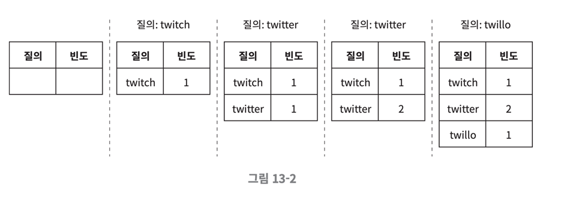

# 013.Design A Search Autocomplete System

Let's design a system that automatically completes and outputs the k most frequently used search terms.

## Understand the problem and confirm the design scope

- The word the user enters must be the first part of the search term to be autocompleted.
- Five autocomplete search terms must be displayed
- The criteria for selecting the 5 items is the search word popularity ranking determined by the frequency of queries.
- Spell check or auto-correction is not supported.
- No capital letters or special characters are processed. Assume that all queries are made up of lowercase English letters.
- 10 million daily active users (DAU)

## Requirements

- Fast response speed: System response speed must be within 100 milliseconds.
- Relevance: The auto-complete search term must be related to the entered word.
- Sorting: Results should be sorted by a ranking model such as popularity.
- Scalability: Must be scalable to handle large amounts of traffic.
- High availability: It must be continuously usable even if part of the system fails or unexpected problems occur.

## Rough size estimation

- Daily active users (DAU) are assumed to be 10 million.
- Assume that on average, a user performs 10 searches per day.
- Assume that 20 bytes of data are input on average each time a query is made.
- Assuming that ASCII is used as the character encoding method, 1 character = 1 byte.
- Assume that a query consists of 4 words on average, and each word consists of 5 letters on average.
- Therefore, the average is 20 bytes per query.
- On average, 20 requests are sent to the backend per search. For example, if you enter dinner, six requests: d, di, din, dinn, dinne, and dinner are sent sequentially.
- Approximately **24,000 queries per second (QPS)** will occur. (10 million users x 10 queries x 20 characters / 24 hours / 3600 seconds = 24,000)
- Max QPS = QPS x 2 = approximately 48,000
- Assuming that 20% of the queries are new search terms, 10 million users x 10 queries / day x 20 characters x 20% = approximately 0.4GB.
- This means that 0.4GB of new data is added to the system every day.

## Present rough design plan and seek consent

At a high level, the system is divided into two parts.

- Data collection service: A system that collects queries entered by users in real time. Real-time systems are not very desirable for data-intensive applications. Therefore, we will replace it again when we create a detailed design.
- Query service: This is a service that sorts five popular search terms for a given query.

## Data collection service

- Suppose there is a frequency table that stores query statements and frequency of use. Initially, this table is empty, but when the user searches for twitch, twitter, twit-ter, and twillo in that order, it changes as shown below.

## Query service

- There is a frequency table as below.
- query: This is a field that stores the query statement.
- frequency: This is a field that stores the frequency with which the query is used.
- When a user enters “tw” in the search box, an auto-complete search term should be displayed by sorting the five most frequent terms in the frequency table below.
- The five most used search terms can be calculated using the SQL query below.

SELECT * FROM frequency_table

WHERE query Like `prefix%`

ORDER BY frequency DESC

LIMIT 5;

- This is not a bad design when the amount of data is small, but when the amount of data increases, it can become a database bottleneck.

## Detailed design

Let's select a few components, design them in more detail, and discuss optimization methods in the following order:

- Trie data structure
- Data collection service
- Inquiry service
- Scalable storage
- Try operation

## Trie data structure

- In the rough design, a relational database was used as the storage. However, using a relational database to select the five most popular queries is not efficient.
- This problem will be solved using a trie (also called a **prefix tree**)
- The trie data structure is a data structure that can briefly store strings.
- It is a data structure designed with a focus on operations that retrieve strings.
- Trie is a tree-shaped data structure.
- The root node of this tree represents the empty string
- Each node stores one letter and can have 26 child nodes (the number of all letters that can appear after that letter).
- Each tree node represents one word, or prefix string
- Below is a trie containing tree, try, true, toy, wish, and win.

- The basic trie data structure stores strings in nodes.
- In order to produce results sorted by frequency of use, frequency information must also be stored in the trie node.
- When frequency information is stored in a trie node, the state is as below.

### How can auto-completion of search words be implemented with this try?

p: Length of prefix

n: Number of nodes in the trie

c: Number of child nodes of a given node

### The k most used query words can be found as follows.

- Find the node that represents the prefix. Time complexity is O(p)
- Search the subtree starting from that node to find all valid nodes. Nodes that constitute a valid search string are valid nodes. Time complexity is O(c)
- Sort valid nodes to find k most popular search terms. Time complexity is O(clogc)
- Total algorithm complexity = O(p) + O(c) + O(clogc)

### Example

- When k=2 and the user enters “be” in the search box

- Find the prefix node ‘be’.
- Find all valid nodes by searching the subtree starting from that node.

[beer: 10], [best: 35], [bet: 29] are valid nodes

- Sort valid nodes and select only two.

[best: 35], [bet: 29] are valid nodes

- These are the two most popular search terms on be.

### Problem

- This algorithm is intuitive, but in the worst case, you may have to search the entire trie to get k results.
- There are two ways to solve this:

1) Limit the maximum length of the prefix

2) Cache popular search words on each node

### Prefix maximum length limit

- Users rarely enter long search terms into the search box.
- Therefore, it is safe to assume that the prefix length p value is a small integer value.
- If we can limit the maximum length, the time complexity of the “find the prefix node” step will change from O(p) to O(small constant value) = O(1).

### Cache popular searches on nodes

- By storing k popular search terms in each node, you can prevent searching the entire trie.
- Displaying 5 to 10 autocomplete suggestions is sufficient, so k is a small value.
- Let’s say we cache five queries. By caching popular queries in each node, the time complexity of querying the ‘top 5’ search terms can be greatly reduced.
- However, it has the disadvantage of requiring a lot of space to store queries in each node. When fast response time is critical, it is worth the sacrifice.

- The picture above is an improved trie structure.
- The five most popular search terms were stored in each node.
- Five search terms [best: 25, bet: 29, bee: 20, be: 15, beer: 10] are cached in the node representing the prefix be.

### Applying two optimization techniques

Time complexity varies as follows:

- The time complexity of finding a prefix node becomes O(1).
- The time complexity of the query to find the five most popular search terms changes to O(1). This is because the search results are already cached.
- Thanks to the time complexity of each step being changed to O(1), the complexity of the entire algorithm for finding the k most popular search terms changes to O(1).

## Data collection service

- The design so far modifies data in real time whenever the user types something into the search box.
- But there are two problems with this.

1) Tens of millions of queries will be entered every day, and if the trie is updated each time, query service will be seriously slowed down.

2) Once a trie is created, popular searches will not change very often. Therefore, the trie does not need to be updated as often.

- For real-time applications like Twitter, there is a need to keep suggested search terms fresh, but for applications like Google Search, there is no reason to change them so frequently.
- Therefore, you can design the service according to the usage case.
- Below is the design of the revised data analysis service.

### Data Analysis Service Log

- Stores original data related to queries entered in the search box.
- New data is only added, no modifications are made, and log data is not indexed.

### Log collection server

- Data collection method varies depending on the usage of the service.
- In the case of real-time applications such as Twitter, it is important to quickly show results, so it is necessary to keep the data collection cycle short.
- However, in most cases, collecting logs once a week is sufficient.
- Therefore, it is important to determine how important real-time data collection is.
- In the case of this design, it will be assumed that collection on a weekly basis is sufficient.

### Collected data

- The table below is an example of data collected every week.

### Job Server

- A worker is a set of servers that periodically execute asynchronous tasks.
- Responsible for creating trie data structures and storing them in the trie database.

### Trie Cache

- It is a distributed cache system.
- Increases read operation performance by maintaining trie data in memory
- Snapshots of the Trie database are taken and updated every week.

### Trie database

- Trie-Database is a persistent store.
- There are two options available as a trie database.

1) Document storage: We will be creating new tries every week, so we can serialize them periodically and save them to the database. You can conveniently store this data by using a document storage such as Mongo DB.

2) Key-value storage: Trie can be converted to hash table form by applying the logic below.

- Convert all prefixes held in the trie to hash table keys
- Convert all data stored in each trie node into hash table values.

- The picture above shows how a trie can be mapped to a hash table.
- Each trie node is converted into one <key, value> pair.

## Query service

- The five most popular search terms were selected using a database through a query service.
- The picture below is a design that improved the inefficiency of the design.

1) Search queries are sent to the load balancer

2) The load balancer sends the query to the API server.

3) The API server retrieves data from the trie cache and constructs an autocomplete search term suggestion response for the request.

4) If the data is not in the trie cache, the data is retrieved from the database and filled in the cache. Then, the next time a query for the same prefix comes, it can be processed using the data stored in the cache. Cache misses can occur if the cache server has insufficient memory or if the cache server has a failure.

### Inquiry service optimization

Since query service must be fast as lightning, let’s consider the following optimization plan.

- AJAX request: For web applications, the browser usually sends an AJAX request to retrieve an autocomplete list of search terms. The advantage of this method is that there is no need to reload the page to send and receive requests.
- Browser caching: For most applications, autocomplete search suggestion results do not change frequently within a short period of time. Therefore, if you place suggested search terms in the browser cache, the results of subsequent queries can be retrieved directly from that cache. The picture below is the response header sent when a search term is entered into the Google search engine. Google caches suggested search terms for one hour. Private means that the response can only be stored in the cache of the user who sent the request. max-age = 3600 means it is only valid for 3600 seconds, or one hour.

- Data sampling:

If you log all query results, it will consume a lot of CPU resources and storage space.

The data sampling technique is to log only 1 out of N requests.

## Trie operation: How do trie-related operations work?

### Trie creation

- The task server is in charge and creates a trie using data collected from logs or databases of data analysis services.

### Trie update

- How to update once a week: Create a new trie and then replace the existing trie.
- Method of updating each node of the trie individually: This method has poor performance. When updating a node, all parent nodes must also be updated, because popular search query results are cached and stored in the parent nodes as well. If the usage frequency of the search word ‘beer’ needs to be updated from 10 to 30, all usage frequency values recorded in the parent nodes of that node will also be updated to 30. Therefore, this is a plan worth considering when the trie is small.

### Delete search term

- Hateful, violent, and other dangerous query words should be removed from the autocomplete results.
- Place a filter layer in front of the trie cache and prevent inappropriate queries from being returned.
- The advantage is that the search results can be freely changed according to the filter rules depending on the filter hierarchy.
- Physically deleting the search term from the database can be done asynchronously in the next update cycle.

## Expand storage size

- Let's solve the scalability problem so that we can respond even when the size of the trie is too large to fit into one server.
- Since you only need to support English, you can consider a method of sharding based on the first letter.
- If two servers are needed to store search words, search words starting with the letters ‘a’ through ‘m’ are stored on the first server, and the rest are stored on the second server.
- If three servers are needed, ‘a’ to ‘i’ are stored on the first server, ‘j’ through ‘r’ are stored on the second server, and the rest are stored on the third server.
- When using this method, the available servers are limited to a maximum of 26. Because there are only 26 letters in the English alphabet.
- To increase the number of servers beyond this, sharding must be done hierarchically.

### Hierarchical Sharding

- The first letter of the search term is used in the first level of sharding.
- The second letter is used for the second level of sharding.
- For example, let’s say you want to store search terms starting with ‘a’ divided into four servers.
- ‘aa’~’ag’, ‘ah’~’an’, ‘ao’~’au’, and the rest can be stored separately in the first, second, third, and fourth servers.

### Distribute data equally to each server

- However, considering that there are more words starting with ‘c’ than words starting with ‘x’, the above method is not a good method.
- It is impossible to distribute data equally to each server.
- To solve this, you can use a sharding method by analyzing patterns of past query data.
- The search term response shard manager (shard map manager) manages information about which search terms are stored on which storage server.
- For example, if the amount of search terms starting with 's' is similar to the sum of all search terms starting with 'u', 'v', 'w', 'x', 'y', and 'z', it would be sufficient to have one shard for 's' and one shard for 'u'~'z' search terms.

## Finish: Additional things to know about:

1) How to expand the system to support multiple languages

- Store Unicode data in a trie.
- Unicode is a standard encoding system that supports all writing systems.

2) If the rankings of popular search terms are different for each country, you can use a different trie for each country.

3) You can increase response speed by storing the trie in CDN.

4) What should I do to reflect trends in search terms that change in real time?

- The popularity of certain search terms may suddenly increase.
- However, the current design is not suitable to support this.
- Because the work server only runs once a week, the trie cannot be updated in a timely manner.
- Even if the server runs in a timely manner, it takes too much time to configure the trie.

## Some ideas for building a real-time search term auto-completion system

- Reduce the amount of data to be worked on through sharding
- Change the ranking model to give more weight to recent search terms.
- It must be considered that data may come in the form of a stream, meaning that there is a possibility that all data may not be available simultaneously. This means that data is continuously generated.
- Stream processing requires a special kind of system. These include Apache Hadoop MapReduce, Apache Spark Streaming, Apache Storm, and Apache Kafka.