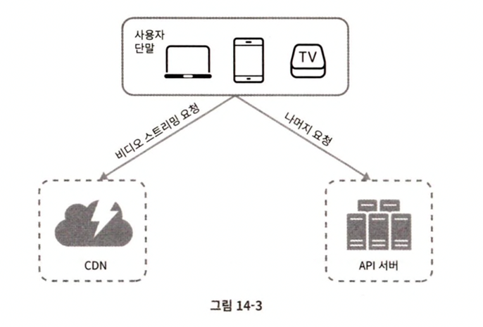

# 014.Design Youtube

## Understand the problem and confirm the design scope

- The ability to upload and watch videos is the most important.
- Supported clients are mobile apps, web browsers, and smart TVs
- Number of daily active users is 5 million (DAU)
- The average time spent by users is 30 minutes.
- Multilingual support is needed
- Must support most of the existing video types and resolutions.
- A playback quality selection function is required.
- Encryption is required
- Video file size limits focus on small or medium-sized videos. Video size is limited to a maximum of 1GB
- You can also use cloud services.

## Rough size estimation

- The number of daily active users (DAU) is 5 million.
- One user watches an average of 5 videos per day
- 10% of users upload 1 video per day
- The average video size is 300MB.
- For video storage, the new storage capacity required every day is = 5 million x 10% x 300MB = 150TB
- CDN costs are as follows:

1) When video is serviced through a cloud CDN, charges are made based on the amount of data leaving the CDN.

2) When using Amazon's CloudFront as a CDN solution, assuming 100% traffic occurs in the United States, a fee of $0.02 per 1GB is incurred.

3) Therefore, the daily fee is = 5 million x 5 videos x 0.3GB x $0.02 = $150,000.

- According to this estimate, the cost of serving video through CDN is enormous. Let’s learn more about how to reduce costs as we proceed with detailed design.

## Present rough design plan and seek consent

- Since it was said that it is okay to use existing cloud services, in the case of CDN and BLOB storage, existing cloud services will be used.
- The reason for not implementing it yourself is that creating a BLOB storage or CDN that is easy to scale is not only extremely complicated but also expensive.
- Even big companies like Netflix or Facebook don't build everything themselves. Netflix uses Amazon's cloud services, and Facebook uses Akamai's CDN.
- The components of the schematic system are as follows.

- Terminal (client): You can watch YouTube through a computer, mobile phone, or smart TV.
- CDN: Videos are stored in CDN. When you press the play button, streaming takes place from the CDN.
- API server: All requests except video streaming are processed by the API server. Feed recommendations, generate video upload URLs, update metadata database and cache, sign up users, etc.

## Video upload procedure

- User: A user who watches YouTube through a computer, mobile phone, or smart TV.
- Load balancer: Responsible for evenly distributing requests to each API server.
- API server: Processes all other requests except video streaming.
- Metadata database (metadata DB): Stores metadata of videos. Apply sharding and multiplexing to meet performance and availability requirements.
- Metadata cache: Video metadata and user objects are cached to improve performance.
- Original storage: A large binary file storage (BLOB, i.e. Binary Large Object storage) system to store the original video.
- Transcoding server: Also called video encoding. This is a procedure for converting video formats (MPEG, HLS, etc.). This is necessary to provide the optimal video stream suited to the terminal or bandwidth requirements.
- Transcoded storage: This is a BLOB storage that stores videos that have completed transcoding.
- CDN: Responsible for caching videos. When the user presses the play button, video streaming occurs through the CDN.
- Transcoding completion queue: A message queue that stores video transcoding completion events.
- Transcoding completion handlers: These are task servers that will retrieve event data from the transcoding completion queue and update the metadata cache and database.

### How video uploads are handled

Video upload is two processes performed in parallel.

1) Upload video

2) Video metadata update. Metadata includes video URL, size, resolution, format, and user information.

### Upload video

1) Upload the video to the **original storage**.

2) The **transcoding server** retrieves the video from the original storage and **starts transcoding.**

3) Once **transcoding is completed**, the two procedures below are performed in parallel.

- **Upload** the completed video to the **transcoding video storage**.
- Put the **transcoding completion event** in the **transcoding completion queue**.
- Upload the **transcoded video to CDN.**
- The **completion handler pulls the event data** from the queue.
- The completion handler **updates the metadata database and cache**.

4) The **API server** **notifies the terminal** that the video **upload is complete** and is **ready for streaming.**

### Update metadata

- While **the file is uploaded to the original storage,** the terminal sends a **video metadata update request** to the API server in parallel.
- The metadata included in this request includes information such as file name, size, and format.
- **The API server** updates **the metadata cache and database** with this information.

## Video streaming procedure

- When you press the video play button on YouTube, streaming starts immediately.
- There is no inconvenience such as having to complete the video download to view the video.
- Streaming is when **the user's device continuously receives a video stream** from a remote location and plays the video.
- Streaming protocol is a standardized communication method used to transmit data for video streaming.
- Examples of streaming protocols include MPEG-DASH, Apple HLS, Microsoft Smooth Streaming, and Adobe HDS.
- The video encoding supported for each of the above protocols is different, and the players are also different.
- Therefore, when designing a video streaming service, you must carefully select a protocol that suits the use case of the service.
- **Videos are streamed directly from CDN**. The CDN edge server closest to the user's device will be responsible for video transmission. Therefore, the transmission delay is very low.

## Detailed design

Let's look at optimization methods and error handling mechanisms.

## Video transcoding

- When recording a video, the terminal saves the video in a specific format.
- For this video to play smoothly on other devices, it must be saved in a bitrate and format that is compatible with other devices.
- Bitrate is a unit that indicates how quickly the bits that make up video must be processed.
- Videos with high bitrates are high-definition videos. To properly play a video stream with a high bitrate, higher-performance computing power is required and the Internet line speed must be faster.

### Why video transcoding is important

- Original, unprocessed original video takes up a lot of storage space.
- Many terminals and browsers support only certain types of video formats. Therefore, to solve compatibility issues, it is advisable to encode one video into multiple formats.
- To ensure uninterrupted high-definition video playback for users, low-definition video must be sent to users with insufficient network bandwidth, and high-definition video must be sent to users with sufficient bandwidth.
- In the case of mobile devices, network conditions may change from time to time. In order to ensure that the video plays without interruption, it is desirable to automatically change the video quality or allow it to be changed manually.

### Encoding format

- Container: It is like a basket that holds video files, audio, and metadata. Container formats can be distinguished by file extensions such as .avi and .mp4.
- Codec: A compression and decompression algorithm designed to reduce file size while preserving video quality. Examples include H.264, VP9, and HEVC.

## Directed Acyclic Graph (DAG) model

- Transcoding video is a task that consumes a lot of computing resources and is time-consuming.
- Content creators have their own video processing requirements
- For example, some people may want to display a watermark on the video, some may want to create their own thumbnail image. Some may prefer high-quality video, while others may find low-quality video sufficient.
- It must be able to support these different types of video processing pipelines.
- Additionally, in order to increase the parallelism of the processing process, an appropriate level of abstraction must be introduced to allow the client programmer to manually define the tasks to be executed.
- For example, Facebook's streaming video engine introduces the Directed Acyclic Graph (DAG) programming model, allowing tasks to be arranged in stages so that the tasks can be executed sequentially or in parallel.
- In this design, a similar DAG model will be introduced to achieve flexibility and parallelism. The figure below shows the DAG model adopted for video transcoding.

- The original video is divided into three parts: video, audio, and metadata.
- The tasks applied to the video are as follows.

1) Inspection: This is a task to check whether the video is of good quality and whether there is any damage.

2) Video encoding: This is the process of encoding video into various combinations of resolution, codec, and bitrate. Below is an example of the result.

3) Thumbnail: This is the process of creating image thumbnails automatically extracted from images or videos uploaded by the user.

4) Watermark: This is the process of displaying identification information about a video in the form of an overlay on the image.

## Video transcoding architecture

- In this design, the video transcoding architecture using cloud services was defined as follows.

- This architecture consists of five main components.
- The result of this architecture operating is an encoded video.

1) Preprocessor

2) DAG scheduler

3) Resource manager

4) Task execution server (resource worker)

5) Temporary storage

### Preprocessor

1) Video segmentation: The video stream is divided into units called GOP (Group of Pictures). GOP is a group of frames arranged in a specific order. One GOP can be played independently and is a few seconds long. Older terminals or browsers do not support video segmentation in GOP units, but in such cases, the preprocessor takes over video segmentation.

2) DAG creation: DAG is created according to the configuration file written by the client programmer. For example, [Download --> Transcoding] creates a DAG consisting of two nodes and one connection line.

3) Data cache: The preprocessor is also a cache of segmented videos. To increase stability, the preprocessor stores GOP and metadata in temporary storage. If video encoding fails, the system resumes encoding using this archived data.

### DAG Scheduler

- The DAG scheduler divides the DAG graph into several stages and then puts each of them into the resource manager's task queue.

- The picture above divides one DAG graph into two work steps.
- In the first step, video, audio, and metadata are separated.
- In the second step, the video file is encoded, thumbnails are extracted, and the audio file is also encoded.

### Resource manager

- Resource managers are responsible for effectively distributing resources.
- It is responsible for determining and managing **which tasks are assigned to which servers**.
- It consists of three queues and a task scheduler as shown below.

- Task queue: This is a priority queue where tasks to be executed are stored.
- Job server queue: This is a priority queue where information on the availability status of job servers is stored.
- Execution queue: A queue that stores currently running tasks and task server information.
- Task Scheduler: Responsible for selecting the optimal task/server combination and instructing the task server to perform the task.

### Task Manager Actions

- Pulls the highest priority task from the task queue.
- Selects a task server suitable for executing the task.
- The task scheduler instructs the task server to execute the task.
- The task scheduler puts information about which server the task is assigned to in the execution queue.
- When a task is completed, the task scheduler removes the task from the execution queue.

### Job Server

- The task server performs tasks defined in the DAG.
- Job servers are also managed separately according to the type of job.

### Temporary storage

- Multiple storage systems can be utilized by implementing temporary storage.
- Which system to choose depends on the type, size, frequency of use, and data validity period of the data to be stored.
- For example, metadata is information that the task server frequently references, and its size is usually small. Therefore, it is good to cache it in memory.
- It is desirable to place video/audio data in BLOB storage.
- Data stored in temporary storage is deleted when video processing is completed.
- Encoded video is the final result of the encoding pipeline. It has a name like funny_720P.mp4

## System optimization

- So far, we have looked at the process of uploading a video, streaming, and transcoding.
- Now let's optimize this system in terms of speed, safety, and cost.

### Speed optimization > Parallel video upload

- Uploading all videos in one upload is inefficient. One video can be split into small GOPs
- If you upload the **divided GOP** in parallel, you can **quickly resume** uploading **even if some parts fail.**
- Upload speed can be increased if the terminal performs the task of dividing the video according to GOP boundaries.

### Speed optimization > Designate the upload center near the user

- You can improve upload speed by placing upload centers in multiple locations.
- US residents will send their videos to the North American upload center, while Chinese users will send their videos to the Asian upload center.
- This design uses CDN as an upload center.

### Speed optimization > Parallelize all procedures

- To achieve low response latency, parallelism can be increased by creating a loosely coupled system.
- The existing design plan must be changed. In existing designs, it can be seen that the output of a certain stage is created using the output of the previous stage as input. If there is such a dependency, it is difficult to increase parallelism. For example, the encoding module had to wait for the download module to finish its work (sequentially).
- To reduce the coupling of this system, a **message queue** is introduced. After introducing the message queue, the encoding module **does not need to wait** for the download module to finish its work. The encoding module can process each event held in the message queue in parallel.

### Stability optimization > Pre-signed upload URL

- Use pre-signed upload URLs to ensure that only authorized users can upload videos to the correct location.
- For this purpose, the upload procedure is changed as follows.

1) The client makes a POST request to the HTTP server. Then, receives a pre-signed URL. Access rights to the object pointed to by the URL have already been granted.

2) The API server returns a pre-signed URL.

3) The client uploads the video to the location indicated by the URL.

### Stability Optimization > Video Protection

- Introduction of digital rights management (DRM) systems: Apple's FairPlay, Google's Widevine, Microsoft's PlayReady, etc.
- AES encryption: A method of encrypting video and setting access rights. Encrypted video is decrypted only when played. Only authorized users can watch encrypted videos
- Watermark: An image overlay containing owner information is placed on top of the video.

### Cost Optimization

- CDN is expensive. The larger the data size, the more expensive it becomes. How can these costs be lowered?
- YouTube’s video streaming follows a long tail distribution. Popular videos are played frequently, while others are rarely viewed. Let's try some optimizations based on this:
- **Popular videos are played through CDN**, and other videos are played through a video server.
- Videos that are not very popular may not need to be encoded. If it's a short video, you can encode it and play it when needed.
- Some videos are only popular in certain regions, so there is no need to move them to other regions.
- Build your own CDN and partner with an Internet Service Provider (ISP). Building your own CDN is a very large project. ISPs include Comcast, AT&T, and Verizon. Partnering with them can lower your internet usage costs.
- All of this optimization is based on data such as content popularity, usage patterns, and video size.

### Error handling

- To create a system that can tolerate failures, it must handle them gracefully and recover quickly. There are two types of system errors.
- Recoverable error: Errors such as failure to transcode a specific video segment are recoverable errors. These errors are usually resolved after a few retries. However, if it continues to fail and recovery is difficult, an appropriate error code must be returned to the client.
- Non-recoverable error: If an unrecoverable error is detected, such as an incorrect video format, the system must stop working on the video and return an appropriate error code to the client.

### Typical solutions to errors

- Upload error: Retry several times.
- Video segmentation error: If an older version of the client cannot segment the video according to GOP boundaries, send the entire video to the server and let the server process the video segmentation.
- Transcoding error: Retry.
- Preprocessing error: Regenerate the DAG graph.
- DAG scheduler error: Reschedule the task.
- Failure occurs in resource manager queue: Use replica
- Job server failure: Retry the job on another server.
- API server failure: Since the API server is a stateless server, new requests will be diverted to another API server.
- Metadata cache server failure: Since the data is multiplexed, you will still be able to retrieve the data from other nodes. A failed cache server is replaced with a new one.
- Metadata database server failure:

1) If the main server dies, replace one of the secondary servers with the main server.

2) If the secondary server dies, read operations are processed through another secondary server, and the dead server is replaced with a new one.

## Finish: Things that may be worth further discussion

- How to secure scale scalability of the API layer: Since the API server is a stateless server, horizontal scale expansion is possible.
- How to ensure scalability of the database layer: multiplexing, sharding
- Live streaming: This is the process of recording and broadcasting video in real time. Live streaming also requires video upload, encoding, and streaming. However, there is a difference from the system we designed. Let’s look at the features of live streaming below.

1) The response delay must be lower. Therefore, you should be careful when choosing a streaming protocol.

2) The need for parallelism will be reduced because small units of data must be processed quickly in real time.

3) Error handling methods must be different. A method that takes too much time is difficult to use.

- Video deleting (takedown): Videos such as those that violate copyright must be taken down. Videos to be taken down can be identified during the upload process or through the user's reporting process.