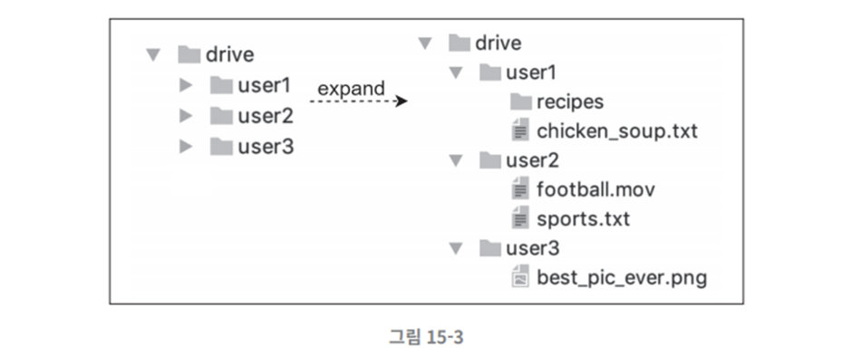

# 015.Design Google Drive

- Google Drive is a file storage and synchronization service that allows you to store documents, photos, videos, and other files in the cloud.
- This file must be available on any device, including computers, smartphones, and tablets.
- Archived files must be easily shareable with friends, family, and colleagues.
- Other cloud storage services include Dropbox, Microsoft OneDrive, and Apple iCloud.

## Understand the problem and confirm the design scope

## Functional equipment

- Must support file upload, download, synchronization, and notification functions.
- Files must be synchronized across multiple devices. Both mobile apps and web apps must be supported. When you add a file on one device, it should automatically synchronize on the other device.
- Files must be encrypted
- File size should be limited to 10GB
- 10 million daily active users (DAU)
- Use drag-and-drop to add files into Google Drive.
- Must be able to check file update history (revision history)
- Must be able to share files
- Show notifications when files are edited, deleted or newly shared

## Non-functional requirements

- Stability: Data loss should not occur
- Fast sync speed: If it takes too much time to sync files, users will lose patience and stop using the product.
- Network bandwidth: Users will not like it if the product consumes unnecessarily large amounts of network bandwidth. Especially if have a mobile data plan.
- Scalability: Must be able to handle large amounts of traffic.
- High availability: The system must remain available even if some servers fail, become slow, or part of the network is disconnected.

## Rough estimate

- There are 50 million registered users and 10 million DAU users.
- 10GB of free storage space is allocated to all users.
- Assume that each user uploads an average of 2 files every day. The average size of each file is approximately 500KB
- Read:Write ratio is 1:1
- Total amount of storage space required = 50 million users * 10GB = 500 Petabytes
- Upload API QPS = 10 million users * 2 uploads / 24 hours / 3600 seconds = approximately 240
- Max QPS = OPS * 2 = 480

## Present rough design plan and seek consent

Let's start with one server and gradually develop it into a system that can support 10 million users.

## Server configuration

Let’s start with one server.

- A web server that will handle the process of uploading and downloading files
- Database to store metadata such as user data, login information, file information, etc.
- A storage system to store your files. Will use 1TB of space to store files

### File storage examples

- Install Apache web server, MySQL database.
- Prepare a directory called drive/ to store uploaded files.
- Within the drive/ directory, there are subdirectories called namespaces.
- Files uploaded by a specific user are stored within each namespace. These files have the same name as the original file.
- Each file and folder can be uniquely identified by combining its relative path with its namespace name.

### API

- This system must provide three APIs
- File upload API, download API, file update history provision API

### 1) File upload API

- Simple upload: Used when the file size is small
- Resumable upload: Use when the file size is large and the upload is likely to be interrupted due to network problems.
- Example of repost API
- -> API URI: https://api.example.com/files/upload?uploadType=resumable
- -> Request Param:

uploadType=resumable

data: local file to upload

- Resume procedure
- -> Send initial request to receive follow-up URL
- -> Upload data and monitor upload status
- -> If an upload failure occurs, the upload restarts from the point of failure.

### 2) File download API

- API URI: https://api.example.com/files/download
- Request Param:

path: Path of the file to download

{

    “path”: “/recipes/soup/best_soup.txt”

}

### 3) File update history API

- API URI: https://api.example.com/files/list_revisions
- Request Param:

path: Path of the file to retrieve update history

limit: maximum history length

{

    “path”: “/recipes/soup/best_soup.txt”,

    “limit”: 20

}

### Security and authentication methods

- All of the above APIs require user authentication and must use the HTTPS protocol.
- The reason for using a protocol that supports SSL (Secure Socket Layer) is to protect the data exchanged between the client and the back-end server.

### Overcome limitations of one server

- As more files are uploaded, the file system becomes full. If there is insufficient free space in the file system, users will no longer be able to upload files.

- To solve this problem, let’s **shard the data and store it on multiple servers.** The picture below is an example of sharding based on user_id.

- If you change the system configuration like this, it will run stably again. However, this is only a temporary solution, and if the server fails, you may lose your data again.
- Accordingly, market leading companies such as Netflix and Airbnb use Amazon S3 as storage.

### Amazon S3

- Amazon S3 is an object storage service that provides industry-leading scalability, availability, security, and performance.
- Amazon S3 supports multiplexing. Multiplexing can be done within the same region, or multiplexing can be done across multiple regions.
- AWS service region is the geographic area where Amazon AWS operates data centers.
- As shown on the right side of the picture below, multiplexing data across multiple regions can prevent data loss and ensure maximum availability.

- An S3 bucket is like a folder in a file system.
- After putting the files in S3, no longer have to worry about data loss.

### Additional improvements

1) Load balancer:

- Used to distribute network traffic.
- Not only it does distribute traffic evenly, but it also automatically bypasses a specific web server when a failure occurs in that server.

2) Web server:

- After adding a load balancer, you can easily add more web servers.
- Therefore, it is possible to easily respond even if traffic surges.

3) Metadata database:

- Avoid SPOF by separating the database from the file storage server.
- Respond to availability and scalability requirements by applying multiplexing and sharding policies.

4) File storage:

- Use S3 as file storage and multiplex data across two or more regions to ensure availability and no data loss.

- After applying the above improvements, the web server, metadata database, and file storage are well separated from one server to multiple servers.

### Sync conflict

- Large storage systems such as Google Drive may experience synchronization conflicts.
- This occurs when two or more users try to update the same file or folder at the same time.
- This means that changes processed first are considered successful, and changes processed later are marked as conflicts.

- User 1 and 2 try to update the same file at the same time
- The system processed user 1's file first.
- User 1’s attempt to update the file is processed normally.
- However, a synchronization conflict error occurs for User 2.

### Sync conflict resolution

- At the time the error occurred, there were two versions of the same file on the system.
- The two versions are the **local copy that User 2** has and **the latest version on the server**.
- The user must decide whether to merge the two files into one or replace one of them with the other.

## Rough design plan

Let’s take a closer look at each component.

### User terminal

Clients such as web browsers and mobile apps used by users

### Block storage server

- A server that uploads file blocks to cloud storage
- Also called block-level storage
- Technology for storing data files in a cloud environment
- **The file is divided into several blocks** and stored, and **each block is assigned a unique hash value.**
- **Hash values are stored in the metadata database.**
- Each block is treated as an independent object **and stored in a cloud storage system** (Amazon S3 in this design)
- To **reconstruct a file, blocks must be combined in their original order.**

### Cloud storage

Files are divided into blocks and stored in cloud storage.

### Archive storage (cold storage)

It is a computer system for storing inactive data that has not been used for a long time.

### Load balancer

It serves to evenly distribute requests to all API servers.

### API server

- This is a server that handles almost everything except file uploads.
- User authentication, user profile management, file metadata update, etc.

### Metadata database

- Manage metadata information such as users, files, blocks, and versions.
- The actual files are stored in the cloud, and only metadata is stored in this database.

### Metadata Cache

To improve performance, cache frequently used metadata

### Notification service

- It is a publish/subscribe protocol-based system used to notify clients that a specific event has occurred.
- Notifies the client that files have been added, edited, or deleted, and allows the client to check the latest status of the files.

### Offline user backup queue

- When the latest status of the file cannot be checked because the client is not connected, place the relevant information in this queue so that it can be synchronized when the client connects later.

# Detailed design

- Keywords: block storage server, metadata database, upload procedure, download procedure, notification service, file storage space, and fault handling flow.

### Block storage server

- Large files that are updated regularly will consume a lot of network bandwidth if the entire file is sent to the server each time an update occurs.
- How to optimize this is as follows:

1) Delta sync: When a file is modified, only the block where the modification occurred is synchronized instead of the entire file.

2) Compression: If compressed in blocks, the data size can be greatly reduced. The compression algorithm is determined by the file type. Text files use gzip or bzip2, and images and videos use other compression algorithms.

- The block storage server is a component that handles important tasks related to file uploads.
- The file sent by the client must be divided into blocks, a compression algorithm applied to each block, and even encrypted.
- Also, instead of sending the entire file to the storage system, only modified blocks must be transferred.
- Let’s see how the block storage server behaves when a new file is added.

- Split the file into small blocks
- Compress each block
- Encrypt
- Send to cloud storage

### Delta synchronization strategy

- Blocks 2 and 5 shown in black below are modified blocks.
- Only the updated parts need to be synchronized, so only these two blocks need to be uploaded to cloud storage.

By introducing a delta synchronization strategy and compression algorithm to the block storage server, network bandwidth usage can be reduced.

### High consistency requirements

- This system must support a strong consistency model.
- It is not acceptable for the same file to appear differently depending on the terminal or user.
- The same principles should apply to the metadata cache and database layer.
- Memory cache supports the eventual consistency model. Therefore, to achieve strong consistency, we must ensure that:

1) The copy stored in the cache matches the original in the database

2) If a change occurs in the original stored in the database, the copy in the cache is invalidated.

- Relational databases guarantee ACID (Atomicity, Consistency, Isolation, Durability), so it is easy to ensure strong consistency.
- However, NoSQL databases do not support this by default, so it must be programmed into the synchronization logic.
- This design will respond to high consistency requirements by adopting a relational database with basic ACID support.

### Metadata database

The picture below is the schema design of this database.

- user: Basic information related to the user, such as name, email, and profile photo, is stored.
- device: Terminal information is stored. push_id is for sending and receiving mobile push notifications. One user can have multiple devices
- namespace: The user's root directory information is stored
- file: The latest information of the file is stored
- file_version: The update history of the file is kept. All records in this table are read-only, preventing update history from being damaged.
- block: Stores information about file blocks. A specific version of a file can be restored simply by assembling the file blocks in the correct order.

### Upload procedure

- What happens when a user uploads a file?
- The figure below shows a sequence diagram where two requests are transmitted in parallel.
- The first request is to add file metadata
- The second request is to upload the file to cloud storage.
- Both requests are from client 1

### 1) Add file metadata

- Client 1 sends a request to add metadata for a new file
- Save the metadata of the new file to the database and change the upload status to pending.
- Notifies the notification service that a new file has been added
- The notification service notifies other related clients (client 2) that a file is being uploaded.

### 2) Upload the file to cloud storage

- Client 1 uploads the file to the block storage server
- The block storage server splits files into blocks, compresses and encrypts them, and transmits them to cloud storage.
- When the upload is finished, cloud storage calls the completion callback. This callback call is sent to the API server
- Change the status of the file recorded in the metadata DB to completed (uploaded).
- Notifies the notification service that file upload is complete.
- The notification service notifies other related clients (client 2) that the file upload is complete.

### Download procedure

- File download starts automatically when a new file is added or edited.
- How does a client detect that another client has edited or added a file?

1) When client A is connected and another client changes a file, the notification service notifies client A that a change has occurred and that a new version should be pulled.

2) If client A is not connected to the network, the data will be stored in the cache. When the status of that client changes to Connecting, then that client will get the new version.

- The client detects that a file has been changed.
- The client retrieves new metadata through the API server.
- Download blocks and reconstruct the file.
- Let’s look at the detailed flow through the sequence diagram below.

- Notification service notifies Client 2 that someone has changed a file
- Client 2 requests new metadata from the API server.
- The API server requests new metadata from the metadata database.
- New metadata is returned to the API server.
- New metadata is returned to Client 2
- Client 2 sends a block download request
- Block storage server downloads blocks from cloud storage
- Cloud storage returns blocks
- The clock storage server returns the block to the client.
- Client 2 reconstructs the file using blocks

### Notification service

- To maintain file consistency, the moment a client detects that a file has been modified locally, it should notify other clients to reduce the possibility of conflicts.
- The notification service is a service that sends event data to the client, and there are two options.

1) Long polling: Dropbox uses this method

2) WebSocket: Provides a continuous communication channel between the client and server. Two-way communication is possible

- This design will use long polling.

### Reasons for choosing long polling

- Unlike chat services, this system does not require two-way communication with notification services.
- The server only needs to notify the client that the file has changed. Communication in the opposite direction is not necessary
- WebSockets are suitable for chat services that require real-time two-way communication.
- In the case of Google Drive, sending notifications does not happen very often, and even when it needs to send a notification, it does not send a large amount of data in a short period of time.

### Long polling details

- Each **client** maintains a **long polling connection with the notification server**, and **disconnects** when it **detects a change** in a specific file.
- The client connects to the metadata server and downloads the latest history of the file.
- When the download operation is finished or the connection timeout period is reached, a new request must be immediately sent to restore and maintain the long polling connection.

### Save storage space

- To preserve file update history and ensure stability, multiple versions of a file must be stored in multiple data centers.
- If you back up all versions frequently, your storage capacity will run out too quickly.
- Therefore, to avoid these problems and save costs, use the methods below.

### 1) De-dupe

- Remove duplicate file blocks at account level
- Determine whether two blocks are the same by comparing their hash values.

### 2) Introduction of intelligent backup strategy

- Limit setting: Place an upper limit on the number of file versions that must be kept. When the upper limit is reached, the oldest version is discarded.
- Keep only important versions: Some files change very frequently. For example, if you manage a new version every time the document you are editing is updated, more than 1,000 versions may be created in a short period of time. Therefore, we must select only the important ones among these.

### 3) Move infrequently used data to archiving storage (cold storage)

- For data that has not been used for several years, use an archiving storage such as Amazon S3 Glacier. The usage fee is much cheaper than S3

### Failure handling

Failures are inevitable in large-scale systems. Let’s take a look at the major obstacles

### Load balancer failure

- If a load balancer fails, the secondary load balancer must be activated to take over the traffic.
- Load balancers periodically send heartbeat signals to monitor their status.
- A load balancer that does not respond to the pulse signal for a certain period of time is considered to have failed.

### Block storage server failure

- If a block storage server fails, another server must take over the unfinished/waiting work.

### Cloud storage failure

- S3 buckets can be multiplexed across multiple regions, so if a failure occurs in one region, you can retrieve files from another region.

### API server failure

- API servers are stateless servers.
- Therefore, when a failure occurs in the API server, the load balancer isolates the failed server by not sending traffic to that server.

### Metadata cache failure

- Metadata cache servers are also multiplexed.
- Even if one node fails, data can be retrieved from another node.
- A failed server can be replaced with a new server.

### Metadata database failure

- Primary database server failure: Change one of the secondary database servers to the primary database server and add a new secondary database server.
- Secondary database server failure: Have another secondary database server process read operations, and replace the failed server with a new one.

### Notification service failure

- **Every user maintains one long polling connection with the notification server.**
- The notification service maintains and manages connections with many users.
- If one server fails, more than a million users must re-create long polling connections.
- It is possible to "maintain" more than a million connections on a single server, but it is not possible to “start” a million connections at the same time.
- Therefore, recovering a long polling connection can be slow.

### Offline user backup queue failure

- Queues must also be multiplexed.
- If a queue failure occurs, subscribing clients must reset their subscription relationship to the backup queue.

# Finish Summary

- High level of consistency, low network latency, and fast synchronization
- File metadata management
- File synchronization processing
- Notification service
- Uses long polling to ensure clients keep the status of files up to date

## Things that would be good to discuss further

### 1) How to upload files directly to cloud storage

- Upload times can be faster if you transfer files directly to cloud storage without going through the block storage server.
- However, since segmentation, compression, and encryption logic must be placed in the client, they must be implemented separately for each platform (iOS, Android, web, etc.). In this design, all of this is collected on a block storage server.
- It is not advisable to place encryption logic inside the client, as there is a possibility that the client can be hacked.

### 2) Connection status management logic

- Move the logic that manages connection status to a separate service
- If the related logic is separated from the notification service, it can be easily utilized in other services.